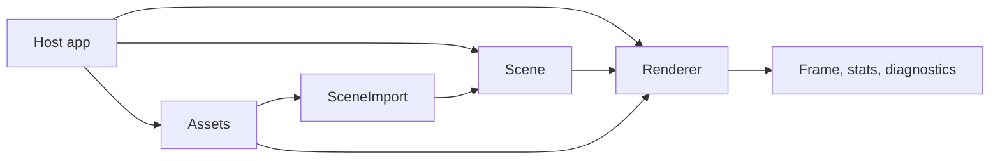

# scena

[](#status)
[](Cargo.toml)
[](#license)

`scena` is a Rust-native scene-graph renderer for model viewers, glTF/GLB
applications, CAD-style viewers, industrial visualization, digital-twin UIs, and
headless rendering proof.

It is designed to give Rust applications the common Three.js scene-graph workflow with
typed scene state, explicit asset ownership, explicit prepare/render lifecycle, structured
diagnostics, and reproducible visual gates.

`scena` is not a game engine, simulation engine, robotics stack, PLC/domain layer,
physics engine, or process-semantics runtime.

## Contents

- [Status](#status)
- [Why scena](#why-scena)
- [Tech Stack](#tech-stack)
- [Install](#install)
- [Getting Started](#getting-started)
- [Configuration](#configuration)
- [Quick Start](#quick-start)
- [Core Model](#core-model)
- [What Works](#what-works)
- [Examples](#examples)
- [Platform Compatibility](#platform-compatibility)
- [Release Evidence](#release-evidence)
- [Project Structure](#project-structure)
- [Documentation Map](#documentation-map)
- [Security](#security)
- [Development](#development)
- [What Is Next](#what-is-next)
- [Acknowledgements](#acknowledgements)
- [License](#license)

## Status

This repository is at a local v1.0 release-candidate baseline, not a published v1.0
release:

- crate version: `1.0.0`;
- minimum Rust version: `1.90`;
- local implementation checklist: M0 through M5 complete with publication-lane deferrals
  recorded in
  [`ADR-0005`](docs/decisions/ADR-0005-local-release-candidate-deferrals.md);
- local package proof: `cargo publish --dry-run --allow-dirty` passed on the release-candidate
  tree;
- API baseline: [`docs/api/m5-public-api-baseline.txt`](docs/api/m5-public-api-baseline.txt).

This checkout has local Linux/headless/browser evidence. The release-gates contract also
defines macOS and Windows smoke lanes; those require CI or matching hardware and are not
represented by a GitHub badge in this repository yet. Tagging, pushing, GitHub CI, and
crates.io publication are separate operator steps. Before publication, the clean release
commit must rerun plain `cargo publish --dry-run` and close or supersede
[`ADR-0005`](docs/decisions/ADR-0005-local-release-candidate-deferrals.md).

## Why scena

Three.js is excellent in JavaScript. Rust applications need a renderer with different
failure modes:

| Need | `scena` approach |
|---|---|
| Avoid stringly scene contracts | typed keys, handles, descriptors, and errors |
| Avoid hidden first-frame work | explicit `prepare()` before `render()` |
| Keep assets and GPU resources separate | `Assets` fetches/parses; `Renderer` uploads/prepares |
| Prove visual behavior | headless, browser, WASM, screenshot, and capability gates |
| Keep app semantics out of the renderer | no simulation, robotics, PLC, process, physics, or game-loop logic |

The current codebase is a renderer foundation and release candidate, not proof that every
Three.js ecosystem feature already exists.

## Tech Stack

| Layer | Technology |
|---|---|
| Language | Rust 2024 edition |
| GPU/render backend | `wgpu` for native/headless GPU paths, with explicit WebGPU/WebGL2 capability lanes |
| Browser/WASM | `wasm-bindgen`, `web-sys`, `wasm-pack`, and Playwright proof scripts |
| Asset format | glTF/GLB first; FBX conversion via external `FBX2glTF` workflow |
| Handles/storage | typed slot-map keys through `slotmap` |
| Test/proof surface | Rust tests, doctests, browser smoke scripts, headless artifacts, doctor rules |

## Install

After publication:

```bash
cargo add scena
```

From this repository:

```toml
[dependencies]
scena = { path = "../scena" }
```

Optional features:

| Feature | Purpose |
|---|---|
| `controls` | platform-neutral orbit/pointer control types |
| `controls-winit` | enables the controls feature for native hosts |
| `controls-web` | enables the controls feature for browser hosts |
| `obj` | reserves the OBJ import feature path |

## Getting Started

Clone the repository and run the fast local checks:

```bash
git clone <repo-url> scena
cd scena
cargo fmt --check
cargo clippy --all-targets -- -D warnings
cargo test
```

Compile the example suite:

```bash
cargo check --examples
```

Run a headless example:

```bash
cargo run --example headless_ci
```

Run the source-derived doctor:

```bash
cargo run -p xtask -- doctor --full
```

## Configuration

`scena` has no required runtime service, database, or API key. Configuration is handled
through Cargo features, renderer options, explicit surface descriptors, and asset retain
policy.

Common knobs:

| API | Use |
|---|---|
| `RendererOptions::with_profile(Profile::Industrial)` | deterministic low-idle static viewer behavior |
| `RendererOptions::with_render_mode(RenderMode::OnChange)` | skip clean frames when nothing visible changed |
| `RendererOptions::with_quality(Quality::High)` | explicit quality override |
| `Assets::set_retain_policy(RetainPolicy::Always)` | retain source/decoded data for reload and robust recovery |
| `Renderer::handle_surface_event(SurfaceEvent::...)` | explicit resize, DPR, visibility, surface, context, and device-loss handling |

## Quick Start

```rust
use scena::{
    Assets, Color, GeometryDesc, MaterialDesc, PerspectiveCamera, Renderer, Scene, Transform,
};

fn main() -> Result<(), Box<dyn std::error::Error>> {
    let assets = Assets::new();
    let cube = assets.create_geometry(GeometryDesc::box_xyz(1.0, 1.0, 1.0));
    let material = assets.create_material(MaterialDesc::unlit(Color::from_srgb_u8(80, 160, 255)));

    let mut scene = Scene::new();
    scene.mesh(cube, material).add()?;

    let camera = scene.add_perspective_camera(
        scene.root(),
        PerspectiveCamera::default(),
        Transform::default(),
    )?;
    scene.set_active_camera(camera)?;

    let mut renderer = Renderer::headless(320, 240)?;
    renderer.prepare_with_assets(&mut scene, &assets)?;
    renderer.render_active(&scene)?;

    Ok(())
}
```

`prepare()` is required before rendering. Asset fetching and parsing belong to `Assets`.
GPU upload, pipeline specialization, batching, capability checks, and render statistics
belong to `Renderer::prepare`. `render()` draws prepared state and returns structured
errors instead of silently fetching, uploading, compiling, or guessing.

## Core Model

| Owner | Responsibility |
|---|---|
| `Scene` | scene graph, nodes, transforms, cameras, lights, clipping, picking, imports, animation mixers, labels, instances, and interaction state |
| `Assets` | fetchers, caches, glTF/GLB parsing, decoded metadata, retain policy, reload, and logical handles |
| `Renderer` | device/surface state, prepared resource tables, render passes, diagnostics, capability reports, stats, and deferred destruction |
| `SceneImport` | import-local roots, names, paths, anchors, clips, pivots, bounds, and stale-import checks |

Typed handles such as `NodeKey`, `GeometryHandle`, `MaterialHandle`, `TextureHandle`,
`EnvironmentHandle`, `AnimationMixerKey`, and `HitTarget` prevent wrong-kind API usage at
compile time. Stale or missing handles return structured `LookupError`, `PrepareError`,
`RenderError`, or asset/import-specific errors.



## What Works

The current implementation includes:

- resource-free and asset-backed headless rendering paths;
- primitive geometry helpers, PBR/unlit/line/wireframe/edge materials, alpha handling, ACES
  plus sRGB output, FXAA, and deterministic headless visual fixtures;
- glTF/GLB scene loading, import-local name/path/anchor/clip lookup, external buffers,
  source unit/coordinate conversion, selected Khronos sample coverage, skinning,
  morph targets, and animation mixer controls;
- directional, point, and spot lights, one explicit shadowed directional light, depth
  prepass counters, reversed-Z capability reporting, origin shifting, and clipping planes;
- picking, hover/selection styles, labels, instances, offscreen targets/readback,
  render-on-change, CPU culling fallback, GPU culling dispatch hooks, surface/context loss
  handling, and platform-neutral orbit controls;
- `renderer.stats()`, `renderer.diagnostics()`, `renderer.capabilities()`,
  `renderer.set_debug()`, and `poll_device()` lifecycle diagnostics;
- `scena-convert`, a small FBX-to-glTF/GLB workflow wrapper around `FBX2glTF` or a
  compatible converter.

The implementation is intentionally renderer-focused. Application semantics remain in the
host application.

## Examples

All examples compile with `cargo check --examples`.

| Example | Shows |
|---|---|
| [`primitive_shapes.rs`](examples/primitive_shapes.rs) | built-in geometry and material setup |
| [`glb_model_viewer.rs`](examples/glb_model_viewer.rs) | loading and instantiating a glTF scene |
| [`picking_selection_hover.rs`](examples/picking_selection_hover.rs) | picking and interaction styling |
| [`instancing.rs`](examples/instancing.rs) | typed instance sets and reserved capacity |
| [`labels_helpers.rs`](examples/labels_helpers.rs) | labels and helper geometry |
| [`animation.rs`](examples/animation.rs) | glTF animation mixer playback |
| [`native_window.rs`](examples/native_window.rs) | native surface descriptor setup |
| [`browser_canvas.rs`](examples/browser_canvas.rs) | browser canvas descriptor setup |
| [`headless_ci.rs`](examples/headless_ci.rs) | deterministic headless rendering for CI |
| [`industrial_static_scene.rs`](examples/industrial_static_scene.rs) | low-idle static viewer profile |

## Platform Compatibility

`scena` separates renderer logic from platform adapters.

| Lane | Status | Contract |
|---|---|---|
| Headless CPU | implemented | deterministic rendered-output tests and CI-friendly proof |
| Headless/native wgpu | implemented foundation on non-WASM targets | device/surface ownership in `Renderer`, with descriptor and attached-window paths |
| Browser WebGPU | platform proof lane | Playwright browser API smoke records rendered output and capability JSON; full Rust attached-canvas rendering remains a follow-up integration task |
| Browser WebGL2 | compatibility proof lane | Playwright browser API smoke records rendered output, context-loss shape, and documented CPU/degraded fallbacks |
| WASM | compile/package proof | `wasm32-unknown-unknown` compile, wasm-pack, size gate, and headless/browser-facing Rust test modules |

Surface resize, DPR changes, visibility changes, surface loss, context loss, context
restore, and device loss are explicit `SurfaceEvent` inputs. Recovery APIs leave prepared
state invalid until the caller runs `prepare()` again.

## Release Evidence

Local v1.0 gates are defined in [`docs/specs/release-gates.md`](docs/specs/release-gates.md)
and summarized in [`docs/checklists/acceptance-index.md`](docs/checklists/acceptance-index.md).
The command list below is the local gate set for this checkout. The full release contract
also names macOS, Windows, WebGPU, and WebGL2 release lanes so CI can make platform proof
visible before publication. Current local deferrals are recorded in
[`ADR-0005`](docs/decisions/ADR-0005-local-release-candidate-deferrals.md).

The final local gate set includes:

```bash
cargo fmt --check
cargo clippy --all-targets -- -D warnings
cargo test
cargo check --examples
env CARGO_TARGET_DIR=/tmp/scena-check-target cargo check --target wasm32-unknown-unknown
wasm-pack build --release --target web --out-dir /tmp/scena-wasm-pack-m5
node tests/browser/m4_platform_smoke.js
RUSTDOCFLAGS=-Dwarnings cargo doc --no-deps --all-features
cargo run -p xtask -- doctor --full
cargo publish --dry-run --allow-dirty
```

Generated local gate artifacts include:

- `target/gate-artifacts/m5-public-api-freeze.json`
- `target/gate-artifacts/m5-benchmarks.json`
- `target/gate-artifacts/m5-wasm-size.json`
- `target/gate-artifacts/m4-platform-browser-smoke.json`, a browser API/capability smoke
  artifact that does not yet prove full Rust attached-canvas rendering

`target/gate-artifacts/` is generated output and is not part of the source package.

## Project Structure

| Path | Purpose |
|---|---|
| [`src/scene.rs`](src/scene.rs) and [`src/scene/`](src/scene/) | scene graph, nodes, transforms, cameras, lights, imports, instances, labels, picking, animation binding |
| [`src/assets.rs`](src/assets.rs) and [`src/assets/`](src/assets/) | asset fetch/cache/load, glTF/GLB parsing, retain/reload, logical handles |
| [`src/render.rs`](src/render.rs) and [`src/render/`](src/render/) | renderer lifecycle, prepare/render, CPU/GPU paths, culling, settings, surface handling |
| [`src/diagnostics.rs`](src/diagnostics.rs) and [`src/diagnostics/`](src/diagnostics/) | public errors, diagnostics, capability reports, stats |
| [`src/material.rs`](src/material.rs), [`src/geometry.rs`](src/geometry.rs), [`src/animation.rs`](src/animation.rs), [`src/picking.rs`](src/picking.rs), [`src/controls.rs`](src/controls.rs) | focused public renderer subsystems |
| [`src/bin/scena-convert.rs`](src/bin/scena-convert.rs) | FBX-to-glTF/GLB conversion workflow wrapper |
| [`tests/`](tests/) | milestone, visual, glTF, browser, platform, and release-gate tests |
| [`crates/xtask/`](crates/xtask/) | repo doctor and source-derived drift checks |
| [`docs/`](docs/) | RFC, specs, checklists, ADRs, agent guidance, and public API baselines |
| [`examples/`](examples/) | compile-checked user-facing workflows |

## Documentation Map

| Document | Purpose |
|---|---|
| [`docs/RFC-rust-3d-renderer.md`](docs/RFC-rust-3d-renderer.md) | canonical charter and design narrative |
| [`docs/specs/public-api.md`](docs/specs/public-api.md) | frozen vocabulary, lifecycle signatures, handles, errors, diagnostics, and stats |
| [`docs/specs/module-boundaries.md`](docs/specs/module-boundaries.md) | ownership boundaries and forbidden cross-module dependencies |
| [`docs/specs/render-lifecycle.md`](docs/specs/render-lifecycle.md) | prepare/render, dirty state, retain policy, and destruction queue rules |
| [`docs/specs/asset-gltf-contract.md`](docs/specs/asset-gltf-contract.md) | glTF/GLB cache, extension, anchor, lookup, reload, and animation contracts |
| [`docs/specs/platform-capabilities.md`](docs/specs/platform-capabilities.md) | native/WebGPU/WebGL2/WASM capability and threading contracts |
| [`docs/specs/visual-quality-contract.md`](docs/specs/visual-quality-contract.md) | color, environment, screenshot, browser, and tolerance rules |
| [`docs/specs/doctor-contract.md`](docs/specs/doctor-contract.md) | source-derived drift and silent-failure guardrails |
| [`docs/checklists/`](docs/checklists/) | M0 through M5 execution and acceptance checklists |
| [`docs/decisions/`](docs/decisions/) | accepted ADRs |

## Security

`scena` is renderer infrastructure, so security mainly means avoiding silent behavior and
unsafe host assumptions:

- asset parsing returns structured `AssetError`, `ImportError`, or `InstantiateError`;
- unsupported required glTF extensions fail explicitly;
- `render()` does not fetch assets, compile first-use shaders, or upload structural
  resources behind the caller's back;
- browser/native surface and context-loss behavior is explicit through `SurfaceEvent`;
- library and binary source under [`src/`](src/) currently contains no `unsafe` Rust;
- tests use `unsafe` only where required for allocation instrumentation;
- the doctor blocks known scope drift, architecture drift, stale docs, and release-gate
  regressions that can be checked mechanically.

Do not load untrusted assets in privileged applications without applying normal file,
network, and resource-budget controls in the host application.

## Development

Agents and contributors should start with [`AGENTS.md`](AGENTS.md). Architectural or
release-facing changes should update the relevant spec/checklist before the checklist box
is considered complete.

Contribution baseline:

1. Add or update the focused test first for behavior changes.
2. Keep ownership boundaries from [`docs/specs/module-boundaries.md`](docs/specs/module-boundaries.md).
3. Update README/specs/examples/checklists for public API or behavior changes.
4. Run the relevant local gates before sending a change for review.

Run the doctor for source-derived contract checks:

```bash
cargo run -p xtask -- doctor --docs
cargo run -p xtask -- doctor --architecture
cargo run -p xtask -- doctor --full
```

The doctor is a guardrail for known silent-failure families. It does not replace unit
tests, rendered-output proof, browser checks, release gates, or review.

## What Is Next

The v1.0 foundation intentionally leaves larger ecosystem features for later releases:

- custom render passes and advanced post-processing;
- broader glTF extension coverage, including compressed texture workflows;
- richer native window integration and hosted browser examples;
- Rust/WASM attached-canvas rendered-output proof for WebGPU and WebGL2;
- macOS Metal and Windows DX12 release-lane proof;
- more complete benchmark baselines across real hardware;
- public CI badges once a GitHub remote and workflows exist;
- published crate/tag/release once the operator chooses to publish.

## Acknowledgements

`scena` builds on the Rust graphics ecosystem, especially `wgpu`, `wasm-bindgen`,
`web-sys`, `slotmap`, and the Khronos glTF sample-asset ecosystem used by the tests. The
project is also intentionally shaped by Three.js' practical scene-graph ergonomics while
using Rust ownership, typed handles, and explicit lifecycle contracts.

## License

Licensed under either of:

- [MIT](LICENSE-MIT)
- [Apache-2.0](LICENSE-APACHE)
