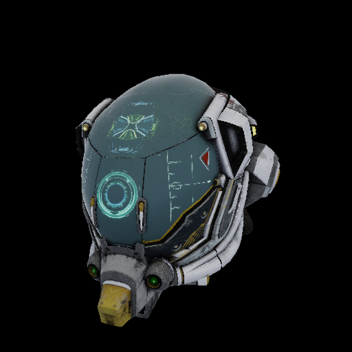
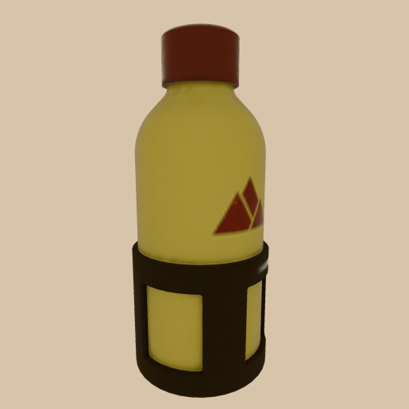
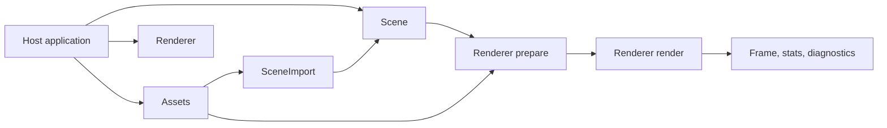

# scena

[](https://github.com/johannesPettersson80/scena/actions/workflows/ci.yml)
[](Cargo.toml)
[](#license)

Rust 3D library

`scena` is an easy-to-use, lightweight 3D library for Rust applications on native and
browser targets. It provides scene graphs, glTF/GLB loading, cameras, lights, materials,
picking, controls, headless rendering, GPU rendering, and deterministic rendered-output
tests through a simple Rust API.

The aim of the project is to make 3D in Rust as straightforward as building a scene,
loading a model, adding a camera and light, and rendering the result.

| DamagedHelmet | WaterBottle |
|---|---|
|  |  |

These are original rendered-output artifacts produced by `scena`.

## Why scena

Rust applications benefit from a focused rendering layer: a library that lets an
application say "here is my scene, my assets, my camera, and my surface; draw it
predictably."

`scena` is that layer.

| If you need | scena gives you |
|---|---|
| A Rust replacement for the common Three.js scene workflow | `Scene`, `Assets`, and `Renderer` with typed handles and structured errors |
| glTF/GLB model-viewer behavior | import, instantiate, frame, inspect, animate, pick, and connect authored anchors |
| CAD and industrial visualization | units, axes, handedness repair, connector metadata, labels, helpers, and deterministic placement |
| Native plus browser targets | wgpu/native foundations, WASM packaging, browser WebGPU/WebGL2 proof lanes, and explicit platform capabilities |
| Reliable render loops | explicit `prepare()` / `render()` lifecycle that keeps fallible work in predictable host-visible steps |
| Release-quality visual confidence | rendered-output examples, browser proof, benchmarks, and published release evidence |

`scena` owns the visual layer: scene graph state, assets, cameras, lights, materials,
interaction data, diagnostics, and rendered-output proof. Host applications keep their
domain model in their own code and drive `scena` through typed renderer APIs.

## Quick start

Clone and run a real viewer example:

```bash
git clone https://github.com/johannesPettersson80/scena.git
cd scena
cargo run --example glb_model_viewer
```

Run the deterministic headless render example used by CI-style workflows:

```bash
cargo run --example headless_ci
```

Compile every public example:

```bash
cargo check --examples
```

## Install

Add `scena` to a Rust application or library:

```bash
cargo add scena
```

Equivalent `Cargo.toml` entry:

```toml
[dependencies]
scena = "1.0"
```

Use a sibling checkout when developing `scena` and an application together:

```toml
[dependencies]
scena = { path = "../scena" }
```

Install the bundled CLI tool:

```bash
cargo install scena
scena-convert --help
```

Cargo features:

| Feature | Purpose |
|---|---|
| `controls` | platform-neutral orbit, pan, zoom, and focus controls |
| `controls-winit` | native-host control adapter support |
| `controls-web` | browser-host control adapter support |
| `browser-probe` | browser/WASM proof entry points used by CI lanes |
| `inspection` | scene inspection metadata for debugging, docs, and reproducible examples |
| `icc` | ICC/color-management support through `lcms2` |
| `ktx2` | KTX2/Basis texture descriptors for `KHR_texture_basisu` assets |
| `meshopt` | meshopt-compressed glTF buffer decoding support |
| `obj` | OBJ import feature path |

## Happy Path

Start with the product workflow: load or create assets, build scene state, prepare once, then render prepared frames. The shortest examples are `glb_model_viewer`, `camera_framing`, `orbit_controls`, `picking_selection_hover`, and `headless_ci`.

## First scene

```rust
use scena::{
    Assets, Color, GeometryDesc, MaterialDesc, PerspectiveCamera, Renderer, Scene, Transform,
};

fn main() -> Result<(), Box<dyn std::error::Error>> {
    let assets = Assets::new();
    let cube = assets.create_geometry(GeometryDesc::box_xyz(1.0, 1.0, 1.0));
    let material = assets.create_material(MaterialDesc::unlit(Color::from_srgb_u8(80, 160, 255)));

    let mut scene = Scene::new();
    scene.mesh(cube, material).add()?;

    let camera = scene.add_perspective_camera(
        scene.root(),
        PerspectiveCamera::default(),
        Transform::default(),
    )?;
    scene.set_active_camera(camera)?;

    let mut renderer = Renderer::headless(320, 240)?;
    renderer.prepare_with_assets(&mut scene, &assets)?;
    renderer.render_active(&scene)?;

    Ok(())
}
```

The important part is the lifecycle: build scene state, prepare renderer resources, then
render prepared state. If the scene, assets, surface, target, or renderer settings change,
call `prepare()` again before rendering.

## Core workflow

```text
Host app
  -> Assets: load/create meshes, materials, textures, environments
  -> Scene: create cameras, lights, nodes, imports, labels, animation, picking targets
  -> Renderer::prepare*: validate, upload, batch, cache, and build prepared renderer state
  -> Renderer::render*: draw prepared state and return frame stats/diagnostics
```

`render()` is intentionally predictable. Fetching, parsing, first-use pipeline work,
structural GPU upload, batching, and capability decisions run through `prepare()`, where
the host receives structured results before drawing frames.

## What you can build

### Model viewers

- Load and instantiate glTF/GLB assets.
- Frame a model or selected node by bounds.
- Orbit, pan, zoom, focus, hover, select, and pick.
- Preserve asset names, paths, anchors, connectors, clips, pivots, and bounds.
- Run the same viewer logic in native or browser-oriented builds.

### CAD-style and industrial visualization

- Convert units and coordinate systems explicitly.
- Repair handedness and axis metadata before placement.
- Snap objects by authored anchors and connectors without raw matrix math.
- Render labels, helper geometry, layers, visibility masks, and helper-on-top views.
- Use deterministic headless output for regression tests and generated documentation.

### Visual proof and CI

- Generate rendered-output artifacts for examples and milestone scenes.
- Run browser WebGPU/WebGL2 proof lanes through Rust/WASM probe entry points.
- Record capability JSON, screenshot metadata, benchmark rows, and release artifacts.

## Capabilities

| Area | Current surface |
|---|---|
| Scene graph | typed nodes, transforms, cameras, lights, clipping planes, imports, labels, instances, picking targets, animation mixers, and dirty-state tracking |
| Assets | glTF/GLB import, external buffers, cache/dedup/reload, source units, coordinate conversion, anchors, connectors, import-local lookup, retain policy, and stale-handle diagnostics |
| Geometry | primitives, manual buffers, bounds, lines, wire/edge expansion, UV retention, CPU skinning, CPU morph targets, and instance sets |
| Materials | unlit and metallic-roughness paths, texture descriptors, vertex colors, alpha modes, normal/occlusion/emissive/base-color slots, variants, ACES/sRGB output, and FXAA |
| Rendering | headless CPU output, native/headless wgpu foundation, explicit prepare/render lifecycle, render-on-change, offscreen targets, readback, stats, diagnostics, shadows, IBL, and release-lane proof artifacts |
| Interaction | typed picking, hover/selection styling, cursor positions, platform-neutral controls, and independent hover/select/pointer-leave states |
| Browser/WASM | wasm32 compile/package, browser WebGPU/WebGL2 proof lanes, attached-canvas probe paths, surface/context/device-loss event vocabulary, and size gates |
| Quality | unit/integration tests, visual artifacts, browser proof, benchmarks, allocation checks, and release evidence |

## Examples by task

| Task | Examples |
|---|---|
| First render and primitives | [`first_visible_render.rs`](examples/first_visible_render.rs), [`primitive_shapes.rs`](examples/primitive_shapes.rs), [`headless_ci.rs`](examples/headless_ci.rs) |
| glTF/model viewer | [`glb_model_viewer.rs`](examples/glb_model_viewer.rs), [`animation.rs`](examples/animation.rs), [`instancing.rs`](examples/instancing.rs) |
| Camera and controls | [`camera_framing.rs`](examples/camera_framing.rs), [`orbit_controls.rs`](examples/orbit_controls.rs), [`orbit_controls_native_adapter.rs`](examples/orbit_controls_native_adapter.rs), [`orbit_controls_browser_adapter.rs`](examples/orbit_controls_browser_adapter.rs) |
| Picking and interaction | [`picking_selection_hover.rs`](examples/picking_selection_hover.rs), [`layers_visibility.rs`](examples/layers_visibility.rs) |
| Anchors, connectors, CAD placement | [`anchor_alignment.rs`](examples/anchor_alignment.rs), [`connect_objects.rs`](examples/connect_objects.rs), [`imported_anchor_connection.rs`](examples/imported_anchor_connection.rs), [`industrial_connector_assembly.rs`](examples/industrial_connector_assembly.rs), [`coordinate_connector_repair.rs`](examples/coordinate_connector_repair.rs), [`coordinate_units.rs`](examples/coordinate_units.rs) |
| Industrial/static scenes | [`industrial_static_scene.rs`](examples/industrial_static_scene.rs), [`static_batching.rs`](examples/static_batching.rs), [`labels_helpers.rs`](examples/labels_helpers.rs) |
| Diagnostics and inspection | [`beginner_diagnostics.rs`](examples/beginner_diagnostics.rs), [`scene_inspection.rs`](examples/scene_inspection.rs) |
| Platform setup | [`native_window.rs`](examples/native_window.rs), [`browser_canvas.rs`](examples/browser_canvas.rs) |

All public examples are part of the compile-check surface.

## Architecture



| Owner | Responsibility |
|---|---|
| `Scene` | graph state, transforms, cameras, lights, labels, imports, animation mixers, picking targets, and dirty tracking |
| `Assets` | fetchers, parsed/decoded resources, caches, retain/reload policy, and logical handles |
| `Renderer` | device/surface state, prepared resource tables, render passes, capability reports, diagnostics, stats, and scheduled resource destruction |
| `SceneImport` | import-local roots, names, paths, anchors, connectors, clips, pivots, bounds, and stale-import checks |

Typed handles such as `NodeKey`, `GeometryHandle`, `MaterialHandle`, `TextureHandle`,
`EnvironmentHandle`, `AnimationMixerKey`, and `HitTarget` prevent wrong-kind API usage at
compile time. Stale or missing handles return structured errors.

## Platform support

| Target | Support |
|---|---|
| Linux native/headless | CI lane with cargo gates, rendered-output tests, examples, capability artifacts, and release JSON |
| macOS Metal | CI lane with tests, examples, docs, platform proof, capability artifacts, and release-lane JSON |
| Windows DX12 | CI lane with tests, examples, docs, platform proof, capability artifacts, and release-lane JSON |
| Headless CPU | deterministic rendered-output path for tests, docs, and artifact generation |
| Browser WebGPU | WASM/browser proof lane with capability and rendered-output probe artifacts |
| Browser WebGL2 | compatibility proof lane with browser API, context-loss, and rendered-output probe artifacts |
| wasm32-unknown-unknown | compile/package/size-gate lane through `wasm-pack` |

Surface resize, DPR changes, visibility changes, surface loss, context loss, context
restore, and device loss are explicit `SurfaceEvent` inputs. Recovery invalidates prepared
state until the host calls `prepare()` again.

## Documentation

| Document | Purpose |
|---|---|
| [`docs/README.md`](docs/README.md) | user documentation index |
| [`docs/getting-started.md`](docs/getting-started.md) | install, first scene, GLB loading, and first output |
| [`docs/api.md`](docs/api.md) | human-readable API overview with docs.rs links |
| [`docs/rendering.md`](docs/rendering.md) | cameras, lights, materials, environments, shadows, and output |
| [`docs/lifecycle.md`](docs/lifecycle.md) | explicit prepare/render lifecycle |
| [`docs/assets.md`](docs/assets.md) | glTF/GLB loading, textures, units, anchors, and connectors |
| [`docs/platforms.md`](docs/platforms.md) | native, browser, WASM, and headless targets |
| [`docs/browser.md`](docs/browser.md) | browser canvas, WebGPU, WebGL2, and WASM integration |
| [`docs/headless-rendering.md`](docs/headless-rendering.md) | deterministic output for CI, docs, and automation |
| [`docs/capabilities.md`](docs/capabilities.md) | backend capability reports and adapter diagnostics |
| [`docs/errors.md`](docs/errors.md) | structured error families and common recovery paths |
| [`docs/feature-flags.md`](docs/feature-flags.md) | optional Cargo features and recommended combinations |
| [`docs/examples.md`](docs/examples.md) | examples grouped by task |
| [`docs/troubleshooting.md`](docs/troubleshooting.md) | common rendering, asset, browser, and placement issues |
| [`docs/guides/migrating-from-threejs.md`](docs/guides/migrating-from-threejs.md) | mapping familiar Three.js workflows to `scena` |
| [`docs/guides/place-and-connect-objects.md`](docs/guides/place-and-connect-objects.md) | placing imported objects by authored anchors and connectors |
| [`docs/guides/units-axes-handedness.md`](docs/guides/units-axes-handedness.md) | unit, axis, and handedness behavior for imported assets |
| [`docs/guides/authoring-gltf-anchors-connectors.md`](docs/guides/authoring-gltf-anchors-connectors.md) | authoring metadata for CAD-style placement workflows |
| [`docs/guides/troubleshooting-misplaced-assets.md`](docs/guides/troubleshooting-misplaced-assets.md) | practical checks for invisible, mis-scaled, or rotated imports |
| [`docs/release-notes/v1.1.0.md`](docs/release-notes/v1.1.0.md) | v1.1.0 release notes for the wgpu-backed WebGL2 renderer |
| [`docs/release-notes/v1.0.1.md`](docs/release-notes/v1.0.1.md) | v1.0.1 release notes and package documentation update |

## Development

Contributor baseline:

```bash
cargo fmt --check
cargo clippy --all-targets -- -D warnings
cargo test
cargo check --examples
```

## Security

`scena` parses external asset formats and creates GPU resources, so hosts should apply
normal file, network, size, memory, and timeout policies for untrusted inputs.

The crate uses structured errors and diagnostics for asset, import, prepare, render, and
lookup failures. Unsupported required glTF extensions fail explicitly instead of silently
rendering wrong output.

## FAQ

**What is scena?**
It is a renderer and scene-graph library for Rust applications that need glTF assets,
model-viewer workflows, CAD-style inspection, industrial visualization, browser/native
targets, and deterministic visual proof.

**Can it replace Three.js?**
Yes for Rust applications that want the scene-graph/model-viewer workflow in a native Rust
package. `scena` focuses on typed Rust APIs, explicit lifecycle control, asset ownership,
deterministic rendering, and native/WASM deployment.

**Why is `prepare()` explicit?**
Because fetch, parse, upload, pipeline, batching, and capability decisions belong in a
predictable step. `render()` draws prepared state with host-visible diagnostics.

**How does resource cleanup work?**
Resource ownership is handle-based and renderer-owned cleanup is explicit. The host works
with typed handles while `scena` schedules renderer resource cleanup through its lifecycle.

**How does application state connect to scena?**
Application state stays in the host application. The host maps visual state into `Scene`,
`Assets`, and `Renderer` APIs for rendering, interaction, diagnostics, and proof.

## Acknowledgements

`scena` builds on the Rust graphics ecosystem, especially `wgpu`, `wasm-bindgen`,
`web-sys`, `slotmap`, `glam`, `image`, `gltf`, `meshopt`, and the Khronos glTF sample
asset ecosystem used by the tests. The API is intentionally shaped by Three.js' practical
scene-graph ergonomics while using Rust ownership, typed handles, and explicit lifecycle
contracts.

## License

Licensed under either of:

- [MIT](LICENSE-MIT)
- [Apache-2.0](LICENSE-APACHE)
