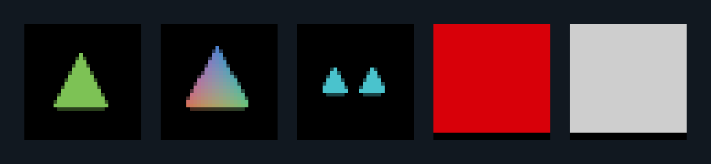
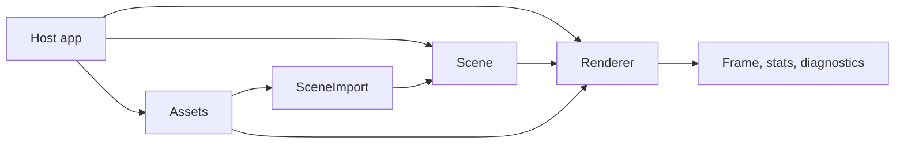

# scena

[](#status)
[](Cargo.toml)
[](#license)

`scena` is a Rust-native scene-graph renderer for model viewers, glTF/GLB applications,
CAD-style viewers, industrial visualization, digital-twin UIs, and deterministic
rendered-output tests.

It brings the practical Three.js scene workflow into Rust with typed scene state, explicit
asset ownership, an explicit `prepare()` / `render()` lifecycle, structured diagnostics,
and release gates that prove visual behavior instead of relying on screenshots by hand.



The strip above is generated from local rendered-output gate artifacts. It is intentionally
small and deterministic: the README shows what the renderer proves today, not a marketing
mockup.

| In One Minute | Details |
|---|---|
| Best for | Rust apps that need inspectable 3D scenes, glTF assets, model-viewer behavior, picking, labels, animation, and reproducible visual tests |
| Not for | game-engine loops, physics, robotics, PLC/domain logic, simulation, or process semantics |
| Current state | v1.0 release candidate; not yet published to crates.io; release deferrals are recorded in [`ADR-0005`](docs/decisions/ADR-0005-local-release-candidate-deferrals.md) |

## Contents

- [Why scena](#why-scena)
- [Try It Locally](#try-it-locally)
- [Install](#install)
- [Quick Start](#quick-start)
- [Happy Path](#happy-path)
- [Core Workflow](#core-workflow)
- [Feature Map](#feature-map)
- [Architecture](#architecture)
- [Examples](#examples)
- [Status](#status)
- [Platform Compatibility](#platform-compatibility)
- [Release Evidence](#release-evidence)
- [Configuration](#configuration)
- [Project Structure](#project-structure)
- [Documentation Map](#documentation-map)
- [Security](#security)
- [Development](#development)
- [FAQ](#faq)
- [Roadmap](#roadmap)
- [Acknowledgements](#acknowledgements)
- [License](#license)

## Why scena

Three.js is excellent in JavaScript. Rust applications need different failure modes:

| Three.js-style need | `scena` contract |
|---|---|
| Create a graph of cameras, lights, meshes, labels, and imported models | `Scene` owns scene graph state through typed keys |
| Load and reuse model/texture data | `Assets` owns fetching, parsing, cache, retain, reload, and deduplication |
| Draw predictably without first-frame surprises | `Renderer::prepare*` uploads/prepares; `render*` only draws prepared state |
| Catch wrong handles and stale imports | typed handles plus structured `LookupError`, `ImportError`, `PrepareError`, and `RenderError` |
| Ship visual behavior with confidence | deterministic headless artifacts, browser smoke, WASM checks, benchmarks, and source-derived doctor rules |

`scena` is intentionally a renderer, not an application semantics layer. The host
application owns business logic, simulation state, robotics logic, process state, and game
rules.

## Try It Locally

```bash
git clone https://github.com/johannesPettersson80/scena.git scena
cd scena
cargo fmt --check
cargo clippy --all-targets -- -D warnings
cargo test
cargo run --example headless_ci
```

Compile every public example:

```bash
cargo check --examples
```

Run the source-derived guardrail:

```bash
cargo run -p xtask -- doctor --full
```

## Install

After publication:

```bash
cargo add scena
```

From a sibling checkout:

```toml
[dependencies]
scena = { path = "../scena" }
```

Supported feature flags:

| Feature | Purpose |
|---|---|
| `controls` | platform-neutral orbit/pointer control types |
| `controls-winit` | enables the controls feature for native hosts |
| `controls-web` | enables the controls feature for browser hosts |
| `inspection` | enables `Scene::inspect()` metadata for debugging and reproducible examples |
| `ktx2` | enables KTX2/Basis texture descriptors for `KHR_texture_basisu` assets |
| `obj` | reserves the OBJ import feature path |

## Quick Start

```rust
use scena::{
    Assets, Color, GeometryDesc, MaterialDesc, PerspectiveCamera, Renderer, Scene, Transform,
};

fn main() -> Result<(), Box<dyn std::error::Error>> {
    let assets = Assets::new();
    let cube = assets.create_geometry(GeometryDesc::box_xyz(1.0, 1.0, 1.0));
    let material = assets.create_material(MaterialDesc::unlit(Color::from_srgb_u8(80, 160, 255)));

    let mut scene = Scene::new();
    scene.mesh(cube, material).add()?;

    let camera = scene.add_perspective_camera(
        scene.root(),
        PerspectiveCamera::default(),
        Transform::default(),
    )?;
    scene.set_active_camera(camera)?;

    let mut renderer = Renderer::headless(320, 240)?;
    renderer.prepare_with_assets(&mut scene, &assets)?;
    renderer.render_active(&scene)?;

    Ok(())
}
```

## Happy Path

The first-page workflow is build a scene, prepare it explicitly, then render prepared
state. The public examples below are the short paths to the major viewer jobs:

| Job | Example |
|---|---|
| Show the first visible scene | [`examples/first_visible_render.rs`](examples/first_visible_render.rs) |
| Load and frame a model | [`examples/glb_model_viewer.rs`](examples/glb_model_viewer.rs) |
| Frame bounds and reset the view | [`examples/camera_framing.rs`](examples/camera_framing.rs) |
| Orbit, pan, zoom, and focus a camera | [`examples/orbit_controls.rs`](examples/orbit_controls.rs) |
| Pick, hover, and select a node | [`examples/picking_selection_hover.rs`](examples/picking_selection_hover.rs) |
| Align helper geometry to imported anchors | [`examples/anchor_alignment.rs`](examples/anchor_alignment.rs) |
| Connect scene-authored objects by named connectors | [`examples/connect_objects.rs`](examples/connect_objects.rs) |
| Connect two imported assets by named anchors | [`examples/imported_anchor_connection.rs`](examples/imported_anchor_connection.rs) |
| Assemble imported parts with connector metadata | [`examples/industrial_connector_assembly.rs`](examples/industrial_connector_assembly.rs) |
| Repair axis metadata before connecting | [`examples/coordinate_connector_repair.rs`](examples/coordinate_connector_repair.rs) |
| Convert CAD-style units and coordinate systems | [`examples/coordinate_units.rs`](examples/coordinate_units.rs) |
| Batch repeated static geometry | [`examples/static_batching.rs`](examples/static_batching.rs) |
| Control layers, visibility, render groups, and helper-on-top | [`examples/layers_visibility.rs`](examples/layers_visibility.rs) |
| Recover from beginner diagnostics | [`examples/beginner_diagnostics.rs`](examples/beginner_diagnostics.rs) |

Placement guides:

- [Place and connect objects without matrix math](docs/guides/place-and-connect-objects.md)
- [Units, axes, and handedness](docs/guides/units-axes-handedness.md)
- [Authoring glTF anchors and connectors](docs/guides/authoring-gltf-anchors-connectors.md)
- [Migrating common Three.js workflows](docs/guides/migrating-from-threejs.md)
- [Troubleshooting misplaced assets](docs/guides/troubleshooting-misplaced-assets.md)

## Core Workflow

`scena` keeps expensive or fallible lifecycle work out of `render()`:

1. Build or mutate `Scene`.
2. Load or create resources in `Assets`.
3. Call `Renderer::prepare(&mut scene)` or `Renderer::prepare_with_assets(&mut scene, &assets)`.
4. Call `render()` or `render_active()` for prepared frames.
5. Re-run `prepare()` after structural scene, asset, target, context, or renderer changes.

This is the central contract: `render()` draws prepared state. It does not fetch assets,
parse files, upload structural GPU resources, compile first-use pipelines, or silently
guess missing state.

## Feature Map

| Area | Current release-candidate surface |
|---|---|
| Scene graph | typed nodes, transforms, cameras, lights, clipping planes, imports, labels, instances, picking, animation mixers, and one-call `Scene::with_default_camera()` |
| Geometry | primitives, manual buffers, boxes, line/wire/edge expansion, bounds, UV0 retention, CPU skinning, CPU morph targets (multi-target weights chunked correctly per glTF spec), and instance sets |
| Materials | unlit and metallic-roughness material paths, vertex colors, alpha blending, texture descriptors with shared `texture_2d_array<f32>` array batching when materials agree on `(sampler, format, dimensions)`, line/wire/edge materials, ACES plus sRGB output, FXAA, and KHR_materials_variants typed runtime variant flips |
| Assets | glTF/GLB first, cache/dedup/reload, external buffers, selected Khronos samples, anchors, import-local lookup, source units, coordinate conversion, `Assets::release_unreferenced()` for explicit eviction, and `AssetStoreId` + `Assets::contains_<kind>` predicates that distinguish wrong-store from stale-handle |
| Rendering | camera-projected headless CPU, headless/native wgpu foundation with real GPU directional shadow caster + comparison-sampled `texture_depth_2d` shadow map, GGX-prefiltered IBL with split-sum BRDF LUT, explicit prepare/render lifecycle, render-on-change, offscreen targets, readback, hot-reload-preserved GPU uploads across `SurfaceEvent::ContextLost → ContextRestored`, stats, diagnostics, `Renderer::headless_default()` zero-arg constructor, and `interactive_gltf_viewer(path, surface)` fluent builder |
| Interaction | typed picking results, hover/selection styles, viewport-aware cursor positions, platform-neutral orbit controls, and an example demonstrating the independent hover / primary-select / pointer-leave states |
| Platform | native descriptor and attached-window paths, browser surface intent, WASM compile/package checks, surface/context/device loss events |
| Quality | doctor rules, public API baseline, visual artifacts, browser API smoke, benchmarks, allocation gates, bad-pattern doctor regression fixtures, six-role release-review schema with frontmatter + JSON-schema validators, and release-candidate deferral ADR |

The implementation is deliberately renderer-focused. Application semantics remain in the
host application.

## Architecture



| Owner | Responsibility |
|---|---|
| `Scene` | scene graph, node transforms, cameras, lights, labels, clipping, picking targets, imports, animation mixers, and dirty state |
| `Assets` | fetchers, caches, glTF/GLB parsing, decoded metadata, retain policy, reload, and logical handles |
| `Renderer` | device/surface state, prepared resource tables, render passes, diagnostics, capability reports, stats, and deferred destruction |
| `SceneImport` | import-local roots, names, paths, anchors, clips, pivots, bounds, and stale-import checks |

Typed handles such as `NodeKey`, `GeometryHandle`, `MaterialHandle`, `TextureHandle`,
`EnvironmentHandle`, `AnimationMixerKey`, and `HitTarget` prevent wrong-kind API usage at
compile time. Stale or missing handles return structured errors.

## Examples

All examples compile with `cargo check --examples`.

| Example | Shows |
|---|---|
| [`primitive_shapes.rs`](examples/primitive_shapes.rs) | built-in geometry and material setup |
| [`glb_model_viewer.rs`](examples/glb_model_viewer.rs) | loading and instantiating a glTF scene |
| [`camera_framing.rs`](examples/camera_framing.rs) | framing scene bounds and looking at a selected node |
| [`picking_selection_hover.rs`](examples/picking_selection_hover.rs) | picking and interaction styling |
| [`anchor_alignment.rs`](examples/anchor_alignment.rs) | snapping scene helpers to imported glTF anchors |
| [`connect_objects.rs`](examples/connect_objects.rs) | typed connector handles without raw matrix math |
| [`imported_anchor_connection.rs`](examples/imported_anchor_connection.rs) | connecting imported glTF anchors by stable names |
| [`industrial_connector_assembly.rs`](examples/industrial_connector_assembly.rs) | assembling imported parts with renderer-neutral connector metadata |
| [`coordinate_connector_repair.rs`](examples/coordinate_connector_repair.rs) | catching handedness metadata before connector placement |
| [`coordinate_units.rs`](examples/coordinate_units.rs) | explicit source unit and coordinate-system conversion |
| [`static_batching.rs`](examples/static_batching.rs) | repeated non-instanced geometry with prepare-time batch metadata |
| [`layers_visibility.rs`](examples/layers_visibility.rs) | layers, camera masks, visibility, render groups, and helper-on-top |
| [`beginner_diagnostics.rs`](examples/beginner_diagnostics.rs) | structured diagnostics and recovery hints |
| [`instancing.rs`](examples/instancing.rs) | typed instance sets and reserved capacity |
| [`labels_helpers.rs`](examples/labels_helpers.rs) | labels and helper geometry |
| [`animation.rs`](examples/animation.rs) | glTF animation mixer playback |
| [`native_window.rs`](examples/native_window.rs) | native surface descriptor setup |
| [`browser_canvas.rs`](examples/browser_canvas.rs) | browser canvas descriptor setup |
| [`headless_ci.rs`](examples/headless_ci.rs) | deterministic headless rendering for CI |
| [`industrial_static_scene.rs`](examples/industrial_static_scene.rs) | low-idle static viewer profile |

## Status

This repository is at a local v1.0 release-candidate baseline, not a published v1.0
release:

| Item | Current state |
|---|---|
| Crate version | `1.0.0-rc.0` |
| Minimum Rust | `1.93` |
| Local implementation checklist | M0 through M5 foundation complete; later renderer, asset, architecture, and release-readiness gates are tracked in [`docs/checklists/`](docs/checklists/). Remaining public-release work is evidence-bound: per-lane CI artifacts, external lane proof where required, clean-tree publish proof, maintainer sign-off, tag, release, and crates.io publication. |
| Phase 6 review status | Six subagent review reports filed under `target/gate-artifacts/reviews/`; `findings.json` (`scena.release.findings.v1`) records 26 findings — 19 closed, 7 deferred (5 are v1.0 GPU-pipeline impl, 2 are CI-lane evidence) |
| API baseline | [`docs/api/m5-public-api-baseline.txt`](docs/api/m5-public-api-baseline.txt) |
| Publication-lane deferrals | [`ADR-0005`](docs/decisions/ADR-0005-local-release-candidate-deferrals.md) (closure path: [`ADR-0006`](docs/decisions/ADR-0006-Local-Release-Candidate-Closure.md); helper: [`scripts/release_publish_dry_run.sh`](scripts/release_publish_dry_run.sh)) |
| Release notes | rc.0 in [`docs/release-notes/v1.0.0-rc.md`](docs/release-notes/v1.0.0-rc.md); v1.0.0 draft in [`docs/release-notes/v1.0.0.md`](docs/release-notes/v1.0.0.md) (Draft until Phase 1B/1C/1D/3/6/8 close) |
| Release-review schema | [`docs/specs/release-reviews.md`](docs/specs/release-reviews.md) defines the per-subagent report, findings register, and maintainer sign-off contracts that release-readiness fail-closes on (frontmatter parser + JSON-schema validators ship in `crates/xtask`) |
| Local package smoke | `cargo publish --dry-run --allow-dirty` is allowed only as a non-release local packaging smoke; public release approval requires clean-tree `cargo publish --dry-run` evidence |

This checkout has local Linux/headless/browser Rust/WASM evidence. Public tag, GitHub
release, GitHub CI run URLs, crates.io publication, macOS Metal proof, Windows DX12 proof,
and clean-tree publish proof remain separate evidence items until those lanes have produced
artifacts for the exact release commit.

## Platform Compatibility

`scena` separates renderer logic from platform adapters.

| Lane | Status | Contract |
|---|---|---|
| Headless CPU | implemented | deterministic rendered-output tests and CI-friendly proof |
| Headless/native wgpu | implemented foundation on non-WASM targets | device/surface ownership in `Renderer`, with descriptor and attached-window paths |
| Browser WebGPU | platform proof lane | Playwright browser API smoke records rendered output and capability JSON; full Rust attached-canvas rendering remains a follow-up integration task |
| Browser WebGL2 | compatibility proof lane | Playwright browser API smoke records rendered output, context-loss shape, and documented CPU/degraded fallbacks |
| WASM | compile/package proof | `wasm32-unknown-unknown` compile, wasm-pack, size gate, and headless/browser-facing Rust test modules |

Surface resize, DPR changes, visibility changes, surface loss, context loss, context
restore, and device loss are explicit `SurfaceEvent` inputs. Recovery APIs leave prepared
state invalid until the caller runs `prepare()` again.

## Release Evidence

Local v1.0 gates are defined in [`docs/specs/release-gates.md`](docs/specs/release-gates.md)
and summarized in [`docs/checklists/acceptance-index.md`](docs/checklists/acceptance-index.md).
The command list below is the local gate set for this checkout. Current local deferrals are
recorded in [`ADR-0005`](docs/decisions/ADR-0005-local-release-candidate-deferrals.md).

```bash
cargo fmt --check
cargo clippy --all-targets -- -D warnings
cargo test
cargo check --examples
env CARGO_TARGET_DIR=/tmp/scena-check-target cargo check --target wasm32-unknown-unknown
wasm-pack build --release --target web --out-dir /tmp/scena-wasm-pack-m5
node tests/browser/m4_platform_smoke.js
RUSTDOCFLAGS=-Dwarnings cargo doc --no-deps --all-features
cargo run -p xtask -- doctor --full
# Non-release local packaging smoke only. Public release approval requires the same
# command on a clean tree, without --allow-dirty.
cargo publish --dry-run --allow-dirty
```

Generated local gate artifacts include:

- `target/gate-artifacts/m5-public-api-freeze.json`
- `target/gate-artifacts/m5-benchmarks.json`
- `target/gate-artifacts/m5-wasm-size.json`
- `target/gate-artifacts/m4-platform-browser-smoke.json`, a browser API/capability smoke
  artifact that does not yet prove full Rust attached-canvas rendering

`target/gate-artifacts/` is generated output and is not part of the source package.

### Phase 8 Clean-Tree Closure

Use [`scripts/release_publish_dry_run.sh`](scripts/release_publish_dry_run.sh) to produce
the clean-tree publish-dry-run evidence
[`ADR-0006`](docs/decisions/ADR-0006-Local-Release-Candidate-Closure.md) requires before
the v1.0 tag:

```bash
scripts/release_publish_dry_run.sh           # dry-run against HEAD
scripts/release_publish_dry_run.sh <commit>  # dry-run against the named commit
```

The helper detaches a fresh worktree at `/tmp/scena-publish-dry-run-<sha>` so the
dry-run sees an unmodified tree free of `node_modules/`, `target/`, and other
working-tree artifacts. It runs the full clean-tree gate set (fmt / clippy / test / doc /
doctor / claim-audit / release-readiness / `cargo publish --dry-run`) and records each
step's exit code and tail output to
`target/gate-artifacts/release-lanes/publish-dry-run.log`. Phase 8 cannot tag v1.0.0
until that log records `status=passed` and the named human maintainer files
`target/gate-artifacts/reviews/maintainer-signoff.toml` against the same commit.

## Configuration

`scena` has no required runtime service, database, or API key. Configuration is handled
through Cargo features, renderer options, explicit surface descriptors, and asset retain
policy.

| API | Use |
|---|---|
| `RendererOptions::with_profile(Profile::Industrial)` | deterministic low-idle static viewer behavior |
| `RendererOptions::with_render_mode(RenderMode::OnChange)` | skip clean frames when nothing visible changed |
| `RendererOptions::with_quality(Quality::High)` | explicit quality override |
| `Assets::set_retain_policy(RetainPolicy::Always)` | retain source/decoded data for reload and robust recovery |
| `Renderer::handle_surface_event(SurfaceEvent::...)` | explicit resize, DPR, visibility, surface, context, and device-loss handling |

## Project Structure

| Path | Purpose |
|---|---|
| [`src/scene.rs`](src/scene.rs) and [`src/scene/`](src/scene/) | scene graph, nodes, transforms, cameras, lights, imports, instances, labels, picking, animation binding |
| [`src/assets.rs`](src/assets.rs) and [`src/assets/`](src/assets/) | asset fetch/cache/load, glTF/GLB parsing, retain/reload, logical handles |
| [`src/render.rs`](src/render.rs) and [`src/render/`](src/render/) | renderer lifecycle, prepare/render, CPU/GPU paths, culling, settings, surface handling |
| [`src/diagnostics.rs`](src/diagnostics.rs) and [`src/diagnostics/`](src/diagnostics/) | public errors, diagnostics, capability reports, stats |
| [`src/material.rs`](src/material.rs), [`src/geometry.rs`](src/geometry.rs), [`src/animation.rs`](src/animation.rs), [`src/picking.rs`](src/picking.rs), [`src/controls.rs`](src/controls.rs) | focused public renderer subsystems |
| [`src/bin/scena-convert.rs`](src/bin/scena-convert.rs) | FBX-to-glTF/GLB conversion workflow wrapper |
| [`tests/`](tests/) | milestone, visual, glTF, browser, platform, and release-gate tests |
| [`crates/xtask/`](crates/xtask/) | repo doctor and source-derived drift checks |
| [`docs/`](docs/) | RFC, specs, checklists, ADRs, agent guidance, and public API baselines |
| [`examples/`](examples/) | compile-checked user-facing workflows |

## Documentation Map

| Document | Purpose |
|---|---|
| [`docs/RFC-rust-3d-renderer.md`](docs/RFC-rust-3d-renderer.md) | canonical charter and design narrative |
| [`docs/specs/public-api.md`](docs/specs/public-api.md) | frozen vocabulary, lifecycle signatures, handles, errors, diagnostics, and stats |
| [`docs/specs/module-boundaries.md`](docs/specs/module-boundaries.md) | ownership boundaries and forbidden cross-module dependencies |
| [`docs/specs/render-lifecycle.md`](docs/specs/render-lifecycle.md) | prepare/render, dirty state, retain policy, and destruction queue rules |
| [`docs/specs/asset-gltf-contract.md`](docs/specs/asset-gltf-contract.md) | glTF/GLB cache, extension, anchor, lookup, reload, and animation contracts |
| [`docs/specs/platform-capabilities.md`](docs/specs/platform-capabilities.md) | native/WebGPU/WebGL2/WASM capability and threading contracts |
| [`docs/specs/visual-quality-contract.md`](docs/specs/visual-quality-contract.md) | color, environment, screenshot, browser, and tolerance rules |
| [`docs/specs/doctor-contract.md`](docs/specs/doctor-contract.md) | source-derived drift and silent-failure guardrails |
| [`docs/specs/release-reviews.md`](docs/specs/release-reviews.md) | subagent review report, findings register, and maintainer sign-off schemas (Phase 6 release-readiness paperwork) |
| [`docs/checklists/`](docs/checklists/) | M0 through M5 execution and acceptance checklists |
| [`docs/decisions/`](docs/decisions/) | accepted ADRs (rc.0 framing in [`ADR-0005`](docs/decisions/ADR-0005-local-release-candidate-deferrals.md); closure path in [`ADR-0006`](docs/decisions/ADR-0006-Local-Release-Candidate-Closure.md)) |
| [`docs/release-notes/`](docs/release-notes/) | release notes ([rc.0](docs/release-notes/v1.0.0-rc.md) is current; [v1.0.0 draft](docs/release-notes/v1.0.0.md) is filled at release time) |

## Security

`scena` is renderer infrastructure, so security mainly means avoiding silent behavior and
unsafe host assumptions:

- asset parsing returns structured `AssetError`, `ImportError`, or `InstantiateError`;
- unsupported required glTF extensions fail explicitly;
- `render()` does not fetch assets, compile first-use shaders, or upload structural
  resources behind the caller's back;
- browser/native surface and context-loss behavior is explicit through `SurfaceEvent`;
- library and binary source under [`src/`](src/) currently contains no `unsafe` Rust;
- tests use `unsafe` only where required for allocation instrumentation;
- the doctor blocks known scope drift, architecture drift, stale docs, and release-gate
  regressions that can be checked mechanically.

Do not load untrusted assets in privileged applications without applying normal file,
network, and resource-budget controls in the host application.

## Development

Agents and contributors should start with [`AGENTS.md`](AGENTS.md). Architectural or
release-facing changes should update the relevant spec/checklist before the checklist box
is considered complete.

Contribution baseline:

1. Add or update the focused test first for behavior changes.
2. Keep ownership boundaries from [`docs/specs/module-boundaries.md`](docs/specs/module-boundaries.md).
3. Update README/specs/examples/checklists for public API or behavior changes.
4. Run the relevant local gates before sending a change for review.

Run the doctor for source-derived contract checks:

```bash
cargo run -p xtask -- doctor --docs
cargo run -p xtask -- doctor --architecture
cargo run -p xtask -- doctor --full
```

The doctor is a guardrail for known silent-failure families. It does not replace unit
tests, rendered-output proof, browser checks, release gates, or review.

## FAQ

**Is `scena` published?**
Not yet. This checkout is a local v1.0 release candidate. `ADR-0005` tracks the proof still
required before a public tag, GitHub release, or crates.io upload.

**Can I replace Three.js with it today?**
Not as a complete Three.js replacement. This release-candidate checkout is useful for the
implemented Rust scene-graph, headless rendering, glTF import, picking, labels, animation,
connector placement, and diagnostics workflows. The native WGSL pipeline includes
per-fragment IBL, GPU-sampled directional shadow maps, and per-draw model/normal uniforms.
Capability claims remain evidence-bound: a feature is not treated as public-release proof
until the matching lane-specific rendered-output artifacts exist for the release commit
(tracked under [`ADR-0005`](docs/decisions/ADR-0005-local-release-candidate-deferrals.md)).
Full WebGL2 parity for IBL specular + shadow-map sampling, the per-backend visual-proof
bundle, and public release proof remain open gates.

**Why is `prepare()` explicit?**
Because first-use fetch, parse, upload, pipeline, batching, and capability failures should
happen in a predictable lifecycle step instead of hiding inside `render()`.

**Does it include physics, simulation, robotics, PLC logic, or game-engine systems?**
No. Those belong in the host application or a separate engine. `scena` owns rendering,
assets, scene graph state, interaction surfaces, diagnostics, and visual proof.

**Why show generated gate artifacts instead of a polished marketing render?**
Because the README should prove the current renderer honestly. The preview image comes from
local rendered-output gates and is meant to stay aligned with what tests actually verify.

## Roadmap

The v1.0 foundation intentionally leaves larger ecosystem features for later releases:

- custom render passes and advanced post-processing;
- broader glTF extension coverage, including compressed texture workflows;
- richer native window integration and hosted browser examples;
- Rust/WASM attached-canvas rendered-output proof for WebGPU and WebGL2;
- macOS Metal and Windows DX12 release-lane proof;
- more complete benchmark baselines across real hardware;
- public CI badges once the public GitHub workflow runs are green for the release branch;
- published crate/tag/release once the operator chooses to publish.

## Acknowledgements

`scena` builds on the Rust graphics ecosystem, especially `wgpu`, `wasm-bindgen`,
`web-sys`, `slotmap`, and the Khronos glTF sample-asset ecosystem used by the tests. The
project is also intentionally shaped by Three.js' practical scene-graph ergonomics while
using Rust ownership, typed handles, and explicit lifecycle contracts.

## License

Licensed under either of:

- [MIT](LICENSE-MIT)
- [Apache-2.0](LICENSE-APACHE)
