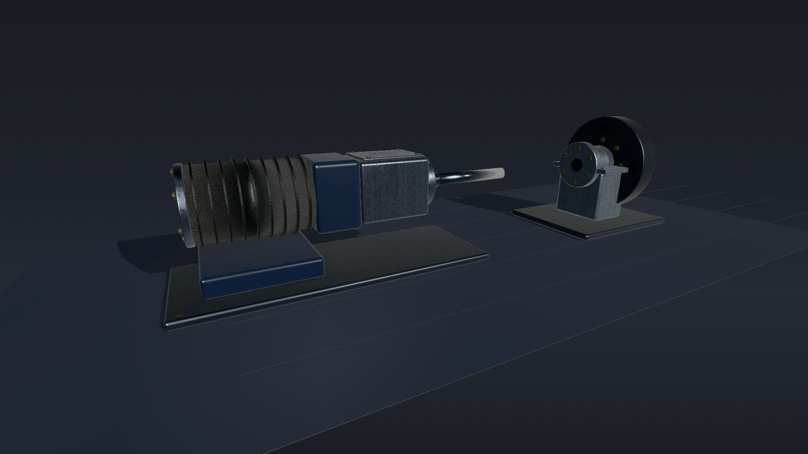
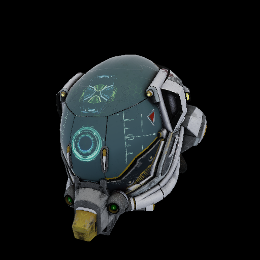
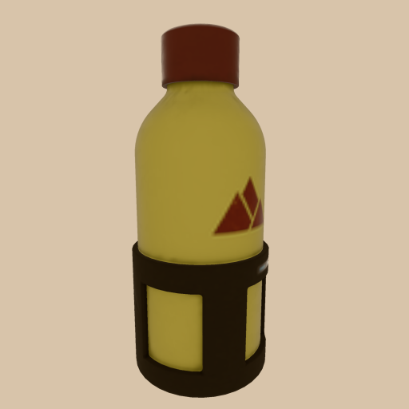
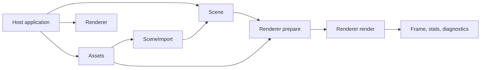

# scena

[](https://github.com/johannesPettersson80/scena/actions/workflows/ci.yml)
[](Cargo.toml)
[](#license)

[](https://scena-demo.pages.dev/)

Rust 3D library

`scena` is an easy-to-use, lightweight 3D library for Rust applications on native and
browser targets. It provides scene graphs, glTF/GLB loading, cameras, lights, materials,
picking, controls, headless rendering, GPU rendering, and deterministic rendered-output
tests through a simple Rust API.

The aim of the project is to make 3D in Rust as straightforward as building a scene,
loading a model, adding a camera and light, and rendering the result.

| DamagedHelmet | WaterBottle |
|---|---|
|  |  |

These are original rendered-output artifacts produced by `scena`.

## Easy Scene Setup

The high-level `headless_gltf_viewer`, `interactive_gltf_viewer`, and
`first_render_gltf_headless` paths frame imported bounds and provide a neutral
background plus fallback light when a glTF has no authored light or
environment. They preserve authored lighting and expose any applied fallback
as a structured diagnostic. Low-level `Renderer` construction remains
explicit, including its black clear color and absence of implicit lights.

The common model-viewer setup therefore does not require hand-tuned camera or
lighting constants. The complete runnable workflow lives in the easy-scene
guide rather than as an uncompiled excerpt.

See [Easy scene setup](docs/guides/easy-scene-setup.md) for the full workflow,
including connector mating and projected labels.

## Why scena

Rust applications benefit from a focused rendering layer: a library that lets an
application say "here is my scene, my assets, my camera, and my surface; draw it
predictably."

`scena` is that layer.

| If you need | scena gives you |
|---|---|
| A Rust replacement for the common Three.js scene workflow | `Scene`, `Assets`, and `Renderer` with typed handles and structured errors |
| glTF/GLB model-viewer behavior | import, instantiate, projection-frame bounds, inspect, animate, pick, and connect authored anchors |
| CAD and industrial visualization | units, axes, handedness repair, connector metadata, labels, helpers, and deterministic placement |
| Native plus browser targets | wgpu/native foundations, WASM packaging, browser WebGPU/WebGL2 proof lanes, and explicit platform capabilities |
| Reliable render loops | explicit `prepare()` / `render()` lifecycle that keeps fallible work in predictable host-visible steps |
| Release-quality visual confidence | rendered-output examples, browser proof, benchmarks, and published release evidence |

`scena` owns the visual layer: scene graph state, assets, cameras, lights, materials,
interaction data, diagnostics, and rendered-output proof. Host applications keep their
domain model in their own code and drive `scena` through typed renderer APIs.

## Quick start

Clone and run a real viewer example:

```bash
git clone https://github.com/johannesPettersson80/scena.git
cd scena
cargo run --example glb_model_viewer
```

That example loads a PBR CAD glTF through documented viewer defaults. The
result is neutrally lit and framed; `FirstRender::diagnostics()` reports that a
fallback was applied so applications can replace it with authored lighting.

Run the deterministic headless render example used by CI-style workflows:

```bash
cargo run --example headless_ci
```

Compile every public example:

```bash
cargo check --examples
```

## Install

Add `scena` to a Rust application or library:

```bash
cargo add scena
```

`cargo add` resolves the current compatible release and avoids a version number
in this living document drifting behind the package metadata.

Use a sibling checkout when developing `scena` and an application together:

```toml
[dependencies]
scena = { path = "../scena" }
```

Install the bundled CLI tool:

```bash
cargo install scena
scena-convert --help
```

Conversion commands default to one machine-readable
`scena.asset_conversion.v1` document. Select the output contract explicitly
when integrating the external converter:

```bash
scena-convert --json --input model.fbx --output model.glb --dry-run
scena-convert --human --input model.fbx --output model.glb
```

JSON mode captures converter progress and warnings inside `diagnostics`; it
never mixes tool text into the JSON stream. Human mode is the explicit
streaming/plain-text path.

Discover the compiled renderer contract, or strictly probe the current GPU,
before spending time on a render:

```bash
scena capabilities --json
scena capabilities --live --json
```

The first result is explicitly `static_no_device`; the second is either a
measured adapter/device report or a nonzero structured `unavailable` report.
`scena --version` lists every compiled Cargo feature that changes public
command or asset availability.

Install the agent-facing recipe workflow with its required features:

```bash
cargo install scena --features agent
scena examples agent list
scena examples agent get primitive-scene --out scena-agent/primitive-scene
scena validate-recipe scena-agent/primitive-scene/recipe.json --full
scena recipe build scena-agent/primitive-scene/recipe.json
scena recipe render scena-agent/primitive-scene/recipe.json --introspect --out frame.png
```

Template catalog output is `scena.agent_template_catalog.v1`. Canonical names
use kebab-case. Historical underscore spellings remain accepted aliases and
add a migration note naming the canonical replacement. The formerly ambiguous
`product_configurator` alias now names `product-configurator-starter`; the
imported material-variant workflow remains `product-configurator`.

Global and command help are successful JSON on stdout, for example
`scena diff --help --json` and `scena examples agent list --help`. Recipe diff
reports inequality as data with exit 0 by default; add `--exit-code` when a
difference should produce exit 1 in CI.

Any command that accepts `<asset-or-recipe>` dispatches by the parsed input
kind. Raw glTF/GLB stays on the direct asset path; a recipe always uses the
policy-aware SceneHost builder and all of its imports. Policy rejection is a
nonzero structured result—commands never report success for a first-import-only
partial scene.

`scena repair <asset-or-recipe> --from <report.json>` validates that target
before deriving a plan: raw assets must pass the runtime asset doctor and
recipes must complete the same policy-aware build used by `recipe build`.
Missing, malformed, or policy-rejected targets fail before the report is
planned; a second positional target is an argument error.

`validate-recipe` defaults to full resolution and inventories imports,
environment URIs or builtins, fonts, authored texture slots, and nested glTF
dependencies through the same policy plan used by `recipe build`. Use
`--syntax-only` only for an explicit no-I/O shape check; its JSON report sets
`execution_equivalent:false`.

Recipe imports and authored nodes use the same tagged local-transform grammar:
`{"kind":"trs","translation":[...],"rotation_degrees":[...],"scale":[...]}`
or `{"kind":"raw","translation":[...],"rotation":[x,y,z,w],"scale":[...]}`.
TRS rotations compose by calling X, then Y, then Z in degrees. Published 1.8.0
recipes with an untagged import transform remain readable with a
`legacy_transform_shape` migration warning; canonical output always writes
`kind:"raw"`.

Recipes are sandboxed to the current directory by default. To authorize an
external model library, add only its directory with repeatable
`--allow-root <directory>` on validation, build, render, inspect, diagnose,
doctor, or repair. The CLI canonicalizes each root, rejects missing roots and
resource symlink/traversal escapes, and reports the effective `policy` in the
result. Preview the exact policy without executing a recipe:

```bash
scena policy recipe --allow-root /srv/model-library
```

There is no sandbox-disable flag; direct asset inputs do not accept the recipe
root option.

Installed agent templates and named environment presets are self-contained:
these commands work outside a repository checkout and do not depend on
`tests/assets`. Template defaults use the packaged `studio` preset and never
replace an explicitly authored `scene.environment`.

## LLM app-builder skill

`scena` includes a repo-hosted LLM skill at
[.codex/skills/scena-app-builder](.codex/skills/scena-app-builder/SKILL.md)
and a model-agnostic guide at
[docs/guides/llm-app-builder.md](docs/guides/llm-app-builder.md). Use them when
asking Codex, Claude Code, or another shell-capable LLM to build a model viewer,
CAD inspection scene, digital twin, product configurator, dashboard,
documentation renderer, or interaction proof with `scena`.
The installed CLI also advertises the public guide from `scena --help`.

They tell the agent to use public schema discovery, scene recipes, validation,
render introspection, verification, diagnostics, and repair tools instead of
guessing fields or reading renderer internals.

Cargo features:

| Feature | Purpose |
|---|---|
| `agent` | complete opt-in recipe, inspection, verification, and SceneHost surface; enables `scene-host`, which enables `inspection` |
| `controls` | compatibility marker; platform-neutral controls are always available |
| `controls-winit` | compatibility alias enabling `controls`; hosts translate native events explicitly |
| `controls-web` | compatibility alias enabling `controls`; hosts translate browser events explicitly |
| `browser-probe` | browser/WASM proof entry points used by CI lanes |
| `inspection` | scene inspection metadata for debugging, docs, and reproducible examples |
| `scene-host` | native/browser SceneHost facade; enables `inspection` |
| `ktx2` | KTX2/Basis texture descriptors for `KHR_texture_basisu` assets |
| `meshopt` | meshopt-compressed glTF buffer decoding support |
| `obj` | OBJ import feature path |

The default feature set remains empty. Use `agent` for the complete
self-verification workflow; use `inspection` or `scene-host` directly only
when deliberately selecting the smaller owner surface. Never list
`scene-host,inspection`: the former already enables the latter.

## Happy Path

Start with the product workflow: load or create assets, add studio lighting,
add a matte grid floor, frame model bounds, prepare once, then render prepared
frames. The shortest examples are `easy_model_viewer`, `camera_framing`,
`connector_auto_framing`, `orbit_controls`, `picking_selection_hover`, and
`headless_ci`.

Transform builder names distinguish replacement from composition:
`with_scale(Vec3)` and `with_uniform_scale(f32)` replace scale, while
`scale_by(f32)` multiplies the current scale and preserves translation and
rotation.

Framing builders use the real output size: pass `FramingOptions::viewport` to
`frame_all_with_assets_and_options` or `frame_import_with_options` for captures
and resizable viewers. Visible bounds are fitted, hidden nodes and inspection
helpers are excluded by default, and presets such as
`three_quarter_front_right` avoid a forced dead-front view. Use
`center_visible_bounds_on` to center geometry whose node origin is offset;
`move_origin_to` is the explicit origin-alignment operation.

Fallible geometry construction: use `GeometryDesc::try_polyline` for runtime or
untrusted point lists. Zero and one point return
`GeometryError::PolylineTooShort` without unwinding; the older panicking
`GeometryDesc::polyline` wrapper is deprecated for compatibility.

## First scene

```rust,no_run
use scena::{Assets, Color, GeometryDesc, MaterialDesc, Renderer, Scene};

fn main() -> Result<(), Box<dyn std::error::Error>> {
    let assets = Assets::new();
    let cube = assets.create_geometry(GeometryDesc::box_xyz(0.8, 0.5, 0.35));
    let material = assets.create_material(MaterialDesc::unlit(Color::BLUE));

    let (mut scene, camera) = Scene::with_default_camera()?;
    scene.mesh(cube, material).add()?;
    scene.frame_all_with_assets(camera, &assets)?;

    let mut renderer = Renderer::headless(320, 240)?;
    renderer.prepare_with_assets(&mut scene, &assets)?;
    renderer.render_active(&scene)?;
    let capture = renderer.capture_rgba8(&scene, Default::default())?;
    capture.write_png("first-scene.png")?;

    Ok(())
}
```

The important part is the lifecycle: build scene state, prepare renderer resources, then
render prepared state. If the scene, assets, surface, target, or renderer settings change,
call `prepare()` again before rendering.
Adapter-optional GPU lifecycle tests report a typed skip when hardware is
unavailable; release evidence uses a separate fail-closed physical-hardware
cycle that proves tracked resources return to baseline and queued destructions
reach zero after confirmed device polling.

## Core workflow

```text
Host app
  -> Assets: load/create meshes, materials, textures, environments
  -> Scene: create cameras, lights, nodes, imports, labels, animation, picking targets
  -> Renderer::prepare*: validate, upload, batch, cache, and build prepared renderer state
  -> Renderer::render*: draw prepared state and return frame stats/diagnostics
```

`render()` is intentionally predictable. Fetching, parsing, first-use pipeline work,
structural GPU upload, batching, and capability decisions run through `prepare()`, where
the host receives structured results before drawing frames.

## What you can build

### Model viewers

- Load and instantiate glTF/GLB assets.
- Frame a model or selected node by bounds.
- Orbit, pan, zoom, focus, hover, select, and pick.
- Preserve asset names, paths, anchors, connectors, clips, pivots, and bounds.
- Run the same viewer logic in native or browser-oriented builds.

### CAD-style and industrial visualization

- Convert units and coordinate systems explicitly.
- Repair handedness and axis metadata before placement.
- Snap objects by authored anchors and connectors without raw matrix math.
- Declare recipe anchors, connector mates, group bounds, and inherited visual
  states with recipe-local stable IDs and a typed build-manifest mapping. These
  are not application-persistence IDs; the host owns durable document identity
  and migrations.
- Render labels, helper geometry, layers, visibility masks, and helper-on-top views.
- Use deterministic headless output for regression tests and generated documentation.

CPU headless triangles are clipped against both camera depth planes before
screen projection. Geometry crossing the near or far plane therefore remains
visible, and the same clipped polygon feeds color, transparency, transmission,
and semantic ID/depth/normal output.

### Visual proof and CI

- Generate rendered-output artifacts for examples and milestone scenes.
- Run browser WebGPU/WebGL2 proof lanes through Rust/WASM probe entry points;
  required WebGPU hardware parity compares CPU-oracle and live renderer pixels
  and rejects six known-bad image mutations.
- Run KHR material feature proofs over declared regions and visible-effect
  floors; disabled and inverted-effect mutations must fail, a two-LSB fake
  effect cannot pass, and harmless one-LSB noise around valid output remains
  accepted.
- Compare local M2 structure against committed source frames with windowed
  SSIM, edge and foreground overlap, heatmaps, and worst-region boxes; broad
  quadrant means remain diagnostic rather than acceptance criteria.
- Record capability JSON, screenshot metadata, pixel-diff heatmaps and worst
  regions, benchmark rows, adapter identity, and source-bound release artifacts.
- Package final Windows physical checks from one clean exact commit with
  `scripts/build_windows_complete_hardware_bundle.sh`; its manifest-verified
  one-shot runner covers required WebGPU pixels, GPU lifecycle, native
  PresentOnly/MSAA/resize/loss, semantic AOV, and controlled shader-cache p95.

## Capabilities

| Area | Current surface |
|---|---|
| Scene graph | typed nodes, transforms, cameras, lights, clipping planes, imports, labels, instances, picking targets, animation mixers, and dirty-state tracking |
| Assets | glTF/GLB import, external buffers, policy-aware cache/dedup/reload, source units, coordinate conversion, anchors, connectors, import-local lookup, retain policy, and stale-handle diagnostics |
| Geometry | primitives with seam-safe cylinder/cone UVs, manual buffers, bounds, lines, wire/edge expansion, UV retention, CPU skinning, CPU morph targets, and instance sets |
| Materials | unlit and metallic-roughness paths, texture descriptors, vertex colors, alpha modes, normal/occlusion/emissive/base-color slots, variants, ACES/sRGB output, and FXAA |
| Rendering | headless CPU output, typed recipe and conservatively attributed rendered diffs, deterministic semantic ID/depth/world-normal AOVs, native/headless wgpu foundation, explicit prepare/render lifecycle, render-on-change, offscreen targets, readback, stats, diagnostics, one directional shadow caster with explicit nine-comparison-tap 3×3 PCF (not point/spot/cascaded shadows), IBL, renderer-managed auto exposure, and release-lane proof artifacts |
| Easy viewer setup | projection-based `frame_bounds`, `add_studio_lighting`, matte `add_grid_floor`, world-to-screen projection, and authored connector mating |
| Interaction | typed picking, hover/selection styling, cursor positions, platform-neutral controls, orbit focus from `FramingOutcome`, captured pointer lifecycle, and independent hover/select/pointer-leave states |
| Browser/WASM | wasm32 compile/package, browser WebGPU/WebGL2 proof lanes, attached-canvas probe paths, explicit sample-count capability/fallback reporting, surface/context/device-loss event vocabulary, and size gates |
| Quality | unit/integration tests, visual artifacts, browser proof, benchmarks, allocation checks, and release evidence |

## Examples by task

| Task | Examples |
|---|---|
| First render and primitives | [`first_visible_render.rs`](examples/first_visible_render.rs), [`primitive_shapes.rs`](examples/primitive_shapes.rs), [`headless_ci.rs`](examples/headless_ci.rs) |
| glTF/model viewer | [`easy_model_viewer.rs`](examples/easy_model_viewer.rs), [`glb_model_viewer.rs`](examples/glb_model_viewer.rs), [`animation.rs`](examples/animation.rs), [`instancing.rs`](examples/instancing.rs) |
| Camera and controls | [`camera_framing.rs`](examples/camera_framing.rs), [`orbit_controls.rs`](examples/orbit_controls.rs), [`orbit_controls_native_adapter.rs`](examples/orbit_controls_native_adapter.rs), [`orbit_controls_browser_adapter.rs`](examples/orbit_controls_browser_adapter.rs) |
| Picking and interaction | [`picking_selection_hover.rs`](examples/picking_selection_hover.rs), [`layers_visibility.rs`](examples/layers_visibility.rs) |
| Anchors, connectors, CAD placement | [`connector_auto_framing.rs`](examples/connector_auto_framing.rs), [`anchor_alignment.rs`](examples/anchor_alignment.rs), [`connect_objects.rs`](examples/connect_objects.rs), [`imported_anchor_connection.rs`](examples/imported_anchor_connection.rs), [`industrial_connector_assembly.rs`](examples/industrial_connector_assembly.rs), [`coordinate_connector_repair.rs`](examples/coordinate_connector_repair.rs), [`coordinate_units.rs`](examples/coordinate_units.rs) |
| Industrial/static scenes | [`industrial_static_scene.rs`](examples/industrial_static_scene.rs), [`static_batching.rs`](examples/static_batching.rs), [`labels_helpers.rs`](examples/labels_helpers.rs) |
| Diagnostics and inspection | [`beginner_diagnostics.rs`](examples/beginner_diagnostics.rs), [`scene_inspection.rs`](examples/scene_inspection.rs) |
| Platform setup | [`native_window.rs`](examples/native_window.rs), [`browser_canvas.rs`](examples/browser_canvas.rs) |

All public examples are part of the compile-check surface.

## Architecture


```mermaid
flowchart LR
    Host[Host application] --> Scene[Scene]
    Host --> Assets[Assets]
    Host --> Renderer[Renderer]
    Assets --> Import[SceneImport]
    Import --> Scene
    Scene --> Prepare[Renderer prepare]
    Assets --> Prepare
    Prepare --> Render[Renderer render]
    Render --> Output[Frame, stats, diagnostics]
```

| Owner | Responsibility |
|---|---|
| `Scene` | graph state, transforms, cameras, lights, labels, imports, animation mixers, picking targets, and dirty tracking |
| `Assets` | fetchers, parsed/decoded resources, caches, retain/reload policy, and logical handles |
| `Renderer` | device/surface state, prepared resource tables, render passes, capability reports, diagnostics, stats, and scheduled resource destruction |
| `SceneImport` | import-local roots, names, paths, anchors, connectors, clips, pivots, bounds, and stale-import checks |

Typed handles such as `NodeKey`, `GeometryHandle`, `MaterialHandle`, `TextureHandle`,
`EnvironmentHandle`, `AnimationMixerKey`, and `HitTarget` prevent wrong-kind API usage at
compile time. Stale or missing handles return structured errors.

## Platform support

| Target | Support |
|---|---|
| Linux native/headless | CI lane with cargo gates, rendered-output tests, examples, capability artifacts, and release JSON |
| macOS Metal | CI lane with tests, examples, docs, platform proof, capability artifacts, and release-lane JSON |
| Windows DX12 | CI lane with tests, examples, docs, platform proof, capability artifacts, and release-lane JSON |
| Headless CPU | deterministic rendered-output path for tests, docs, and artifact generation |
| Browser WebGPU | WASM/browser proof lane with capability and rendered-output probe artifacts |
| Browser WebGL2 | compatibility proof lane with browser API, context-loss, and rendered-output probe artifacts |
| wasm32-unknown-unknown | compile/package/size-gate lane through `wasm-pack` |

Surface resize, DPR changes, visibility changes, surface loss, context loss, context
restore, and device loss are explicit `SurfaceEvent` inputs. Recovery invalidates prepared
state until the host calls `prepare()` again. Attached acquisition also refreshes and retries
`Outdated` exactly once, latches `Lost` for surface recreation, reports timeout/occlusion as
counted skipped frames, and returns validation or out-of-memory as structured hard errors.

## Documentation

| Document | Purpose |
|---|---|
| [`docs/README.md`](docs/README.md) | user documentation index |
| [`docs/getting-started.md`](docs/getting-started.md) | install, first scene, GLB loading, and first output |
| [`docs/api.md`](docs/api.md) | human-readable API overview with docs.rs links |
| [`docs/rendering.md`](docs/rendering.md) | cameras, lights, materials, environments, shadows, and output |
| [`docs/lifecycle.md`](docs/lifecycle.md) | explicit prepare/render lifecycle |
| [`docs/assets.md`](docs/assets.md) | glTF/GLB loading, textures, units, anchors, and connectors |
| [`docs/platforms.md`](docs/platforms.md) | native, browser, WASM, and headless targets |
| [`docs/browser.md`](docs/browser.md) | browser canvas, WebGPU, WebGL2, and WASM integration |
| [`docs/headless-rendering.md`](docs/headless-rendering.md) | deterministic output for CI, docs, and automation |
| [`docs/capabilities.md`](docs/capabilities.md) | backend capability reports and adapter diagnostics |
| [`docs/errors.md`](docs/errors.md) | structured error families and common recovery paths |
| [`docs/feature-flags.md`](docs/feature-flags.md) | optional Cargo features and recommended combinations |
| [`docs/examples.md`](docs/examples.md) | examples grouped by task |
| [`docs/troubleshooting.md`](docs/troubleshooting.md) | common rendering, asset, browser, and placement issues |
| [`docs/guides/migrating-from-threejs.md`](docs/guides/migrating-from-threejs.md) | mapping familiar Three.js workflows to `scena` |
| [`docs/guides/place-and-connect-objects.md`](docs/guides/place-and-connect-objects.md) | placing imported objects by authored anchors and connectors |
| [`docs/guides/units-axes-handedness.md`](docs/guides/units-axes-handedness.md) | unit, axis, and handedness behavior for imported assets |
| [`docs/guides/authoring-gltf-anchors-connectors.md`](docs/guides/authoring-gltf-anchors-connectors.md) | authoring metadata for CAD-style placement workflows |
| [`docs/guides/troubleshooting-misplaced-assets.md`](docs/guides/troubleshooting-misplaced-assets.md) | practical checks for invisible, mis-scaled, or rotated imports |
| [`docs/release-notes/v1.9.0.md`](docs/release-notes/v1.9.0.md) | v1.9.0 correctness, portability, agent workflow, proof-quality, and performance notes |
| [`docs/release-notes/v1.8.0.md`](docs/release-notes/v1.8.0.md) | v1.8.0 notes for deterministic authoring workflows, renderer correctness, cross-backend GPU proof, and enforceable release evidence |
| [`docs/release-notes/v1.7.2.md`](docs/release-notes/v1.7.2.md) | v1.7.2 patch notes for chrome showcase reflections, recipe tessellation validation, and CI proof hardening |
| [`docs/release-notes/v1.7.1.md`](docs/release-notes/v1.7.1.md) | v1.7.1 patch notes for the CI-sized WaterBottle CPU release proof |
| [`docs/release-notes/v1.7.0.md`](docs/release-notes/v1.7.0.md) | v1.7.0 release notes for post-processing, instanced SceneHost imports, strokes, animation playback, and presentation transitions |
| [`docs/release-notes/v1.5.0.md`](docs/release-notes/v1.5.0.md) | v1.5.0 release notes for expanded material presets, WebGL2 texture clamping, and smooth-metal browser IBL improvements |
| [`docs/release-notes/v1.4.0.md`](docs/release-notes/v1.4.0.md) | v1.4.0 release notes for easy-use named primitives, bundled content, viewer ergonomics, `<scena-viewer>` element, and renderer-feature coverage |
| [`docs/release-notes/v1.3.0.md`](docs/release-notes/v1.3.0.md) | v1.3.0 release notes for easy scene setup, connector showcase materials, and browser demo proof |
| [`docs/release-notes/v1.1.0.md`](docs/release-notes/v1.1.0.md) | v1.1.0 release notes for the wgpu-backed WebGL2 renderer |
| [`docs/release-notes/v1.0.1.md`](docs/release-notes/v1.0.1.md) | v1.0.1 release notes and package documentation update |

## Development

Contributor baseline:

```bash
cargo fmt --check
cargo clippy --all-targets -- -D warnings
cargo test
cargo check --examples
```

## Security

`scena` parses external asset formats and creates GPU resources, so hosts should apply
normal file, network, size, memory, and timeout policies for untrusted inputs.

The crate uses structured errors and diagnostics for asset, import, prepare, render, and
lookup failures. Unsupported required glTF extensions fail explicitly instead of silently
rendering wrong output. Missing triangle normals are computed as reported flat
shading; secondary skin sets are reduced to the strongest four with a structured
warning; node morph overrides are preserved; and material texture requests for
unsupported UV sets fail with their exact slot instead of sampling UV0. Invalid
anchor or connector TRS, basis, and matrix extras abort the asset transaction
with their exact JSON path instead of degrading authored orientation to
identity. Generated cylinders and cones use duplicated `u=1` seam vertices so
their last side quad samples only the final local texture interval.
Misspelled node/mesh-resource, material, animation, variant, anchor, connector,
template, environment-preset, and schema names return up to three
deterministically ranked `candidates` in typed errors or JSON diagnostics. A
missing active camera retains the direct `Scene::add_default_camera` and
`Scene::set_active_camera` remedy through renderer, SceneHost, and JSON error
conversion.

## FAQ

**What is scena?**
It is a renderer and scene-graph library for Rust applications that need glTF assets,
model-viewer workflows, CAD-style inspection, industrial visualization, browser/native
targets, and deterministic visual proof.

**Can it replace Three.js?**
Yes for Rust applications that want the scene-graph/model-viewer workflow in a native Rust
package. `scena` focuses on typed Rust APIs, explicit lifecycle control, asset ownership,
deterministic rendering, and native/WASM deployment.

**Why is `prepare()` explicit?**
Because fetch, parse, upload, pipeline, batching, and capability decisions belong in a
predictable step. `render()` draws prepared state with host-visible diagnostics.

**How does resource cleanup work?**
Resource ownership is handle-based and renderer-owned cleanup is explicit. The host works
with typed handles while `scena` schedules renderer resource cleanup through its lifecycle.

**How does application state connect to scena?**
Application state stays in the host application. The host maps visual state into `Scene`,
`Assets`, and `Renderer` APIs for rendering, interaction, diagnostics, and proof.

## Acknowledgements

`scena` builds on the Rust graphics ecosystem, especially `wgpu`, `wasm-bindgen`,
`web-sys`, `slotmap`, `glam`, `image`, `gltf`, `meshopt`, and the Khronos glTF sample
asset ecosystem used by the tests. The API is intentionally shaped by Three.js' practical
scene-graph ergonomics while using Rust ownership, typed handles, and explicit lifecycle
contracts.

## License

Licensed under either of:

- [MIT](LICENSE-MIT)
- [Apache-2.0](LICENSE-APACHE)
