# Easy scene setup

`scena` includes viewer helpers for the common "load a model, make it readable,
and render it" workflow. The helpers are composable: framing, lighting, floor
placement, auto exposure, orbit controls, and connector mating stay separate so
applications can replace any part.

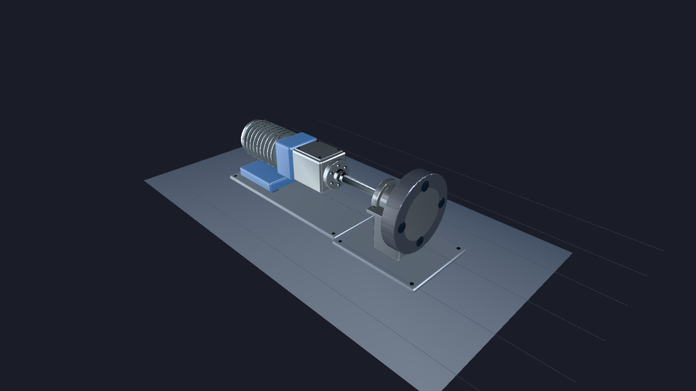

The image above is one render produced by following the steps on this page.
Every image embedded below comes from
[`examples/easy_scene_showcase.rs`](../../examples/easy_scene_showcase.rs); run it with
`cargo run --example easy_scene_showcase --release` to regenerate them.

## Minimal model viewer

```rust
use scena::{
    Assets, AutoExposureConfig, Background, GridFloorOptions, Renderer, Scene,
};

let assets = Assets::new();
let model = assets.load_scene("machine.glb").await?;

let mut scene = Scene::new();
let import = scene.instantiate(&model)?;
let bounds = import.bounds_world(&scene).ok_or("model has no bounds")?;

scene.add_studio_lighting()?;
scene.add_grid_floor(&assets, GridFloorOptions::new().under_bounds(bounds))?;

let width = 1280;
let height = 720;
let camera = scene.add_perspective_camera_default_for(bounds, (width, height))?;

let mut renderer = Renderer::headless(width, height)?;
renderer.set_background(Background::Studio);
renderer.set_auto_exposure(AutoExposureConfig::product_studio());
renderer.prepare_with_assets(&mut scene, &assets)?;
renderer.render(&scene, camera)?;
```

The sequence is still explicit: load assets, instantiate scene state, add
lights/floor/camera, prepare, render. `add_perspective_camera_default_for()`
uses `frame_bounds()` internally to mutate camera state and mark the scene
dirty, but it does not fetch assets, prepare GPU resources, or render.

## Good defaults

Use `Scene::add_studio_lighting()` when the asset does not author lights. It is
a broad product-viewer setup: a shadowed key light plus softer fill and rim
lights. It is not a replacement for a deliberately authored lighting rig.
For custom rigs, start from the same named presets instead of raw lux or
candela values:

```rust
scene.directional_light(DirectionalLight::key_light()).add()?;
scene.directional_light(DirectionalLight::fill_light()).add()?;
scene.point_light(PointLight::bulb_warm()).add()?;
```

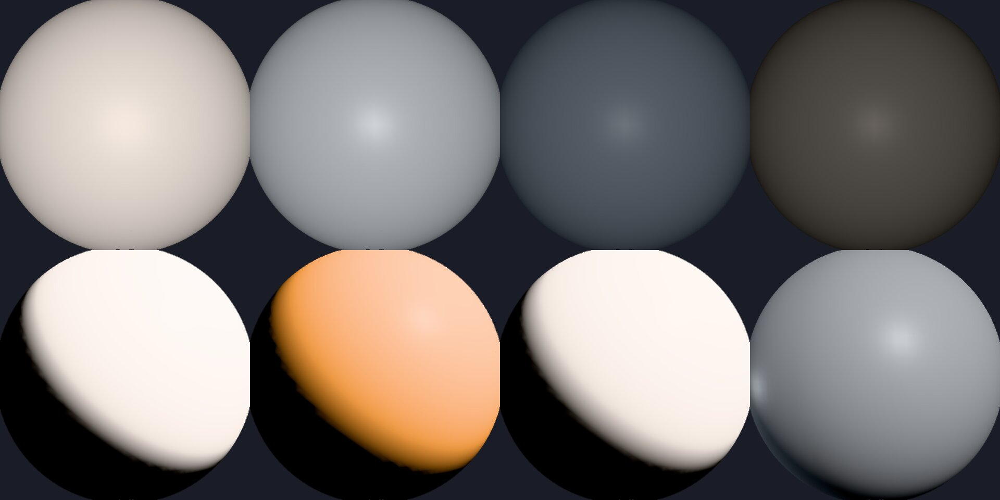

Top row, left to right: `DirectionalLight::sun` (warm daylight),
`key_light` (cool studio main), `fill_light` (softer counter),
`rim_light` (subtle edge). Bottom row: `PointLight::softbox`,
`PointLight::bulb_warm` (2700K), `PointLight::bulb_cool` (5600K), and
the `Scene::add_studio_lighting()` key+fill+rim composite.

Use named exposure scenarios to adapt output brightness from the rendered
frame:

```rust
renderer.set_auto_exposure(AutoExposureConfig::product_studio());
renderer.set_auto_exposure(AutoExposureConfig::indoor());
renderer.set_auto_exposure(AutoExposureConfig::outdoor());
renderer.set_auto_exposure(AutoExposureConfig::mixed());
```

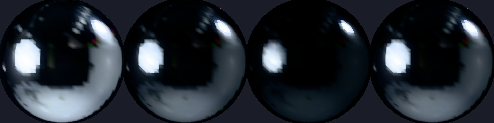

Auto exposure prevents globally too-dark or too-bright frames. It does not
change light direction, material albedo, roughness, dynamic range, or
composition.

Use named backgrounds for the first render instead of typing raw RGB values:

```rust
renderer.set_background(Background::Studio);
renderer.set_background(Background::DarkStudio);
renderer.set_background(Background::Custom(Color::from_hex("#f5f7fb")?));
```

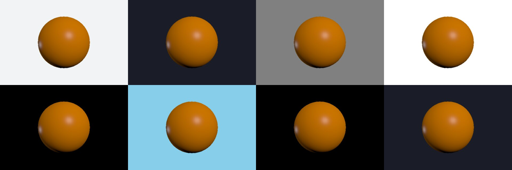

Only the background changes between panels above; the sphere itself is
unchanged because exposure is held fixed.

Use `Scene::add_grid_floor()` for a matte floor at a known plane. The default
floor is dark, rough, non-metallic, and sized from object bounds so it grounds
the object without becoming the subject.
For simple authored geometry, prefer honest material presets over raw
metallic/roughness numbers. This covers the whole shipped preset family:

```rust
let matte_panel = assets.create_material(MaterialDesc::matte(Color::DARK_GRAY));
let plastic_shell = assets.create_material(MaterialDesc::plastic(Color::BLUE));
let metal_shaft = assets.create_material(MaterialDesc::metal(Color::LIGHT_GRAY));
let rough_casting = assets.create_material(MaterialDesc::rough_metal(Color::GRAY));
let chrome_trim = assets.create_material(MaterialDesc::chrome());
let brushed_rail = assets.create_material(MaterialDesc::brushed_steel());
let coated_cover = assets.create_material(MaterialDesc::clearcoat_plastic(Color::ORANGE));
let satin_fabric = assets.create_material(MaterialDesc::satin(Color::MAGENTA));
let leather_grip = assets.create_material(MaterialDesc::leather(Color::CHARCOAL));
let clear_window = assets.create_material(MaterialDesc::clear_glass(Color::CYAN));
let frosted_lens = assets.create_material(MaterialDesc::frosted_glass(Color::COOL_WHITE));
let rubber_foot = assets.create_material(MaterialDesc::rubber());
```

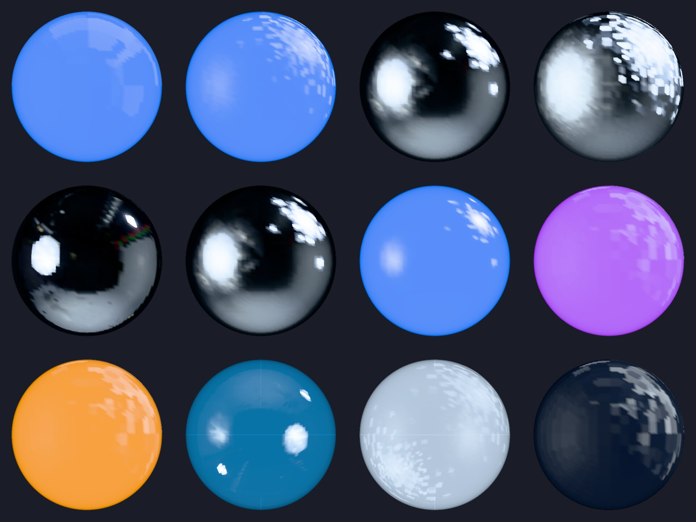

The first-path presets now cover matte, plastic, polished and rough metal,
chrome, brushed steel, clearcoat plastic, satin, smooth leather-like sheen,
transparent/frosted glass, and rubber. On attached GPU backends whose
capability report has `physical_glass_transmission=supported`, `clear_glass`
and `frosted_glass` use scene-color transmission with IOR/thickness
refraction and roughness-driven blur. CPU/reference and unattached factory
capability rows remain degraded for physical glass, and the presets do not
claim caustics.

For colours, name the constant the design calls for instead of writing
RGB literals — `Color::CHARCOAL`, `Color::WARM_WHITE`, `Color::ORANGE`,
and so on:

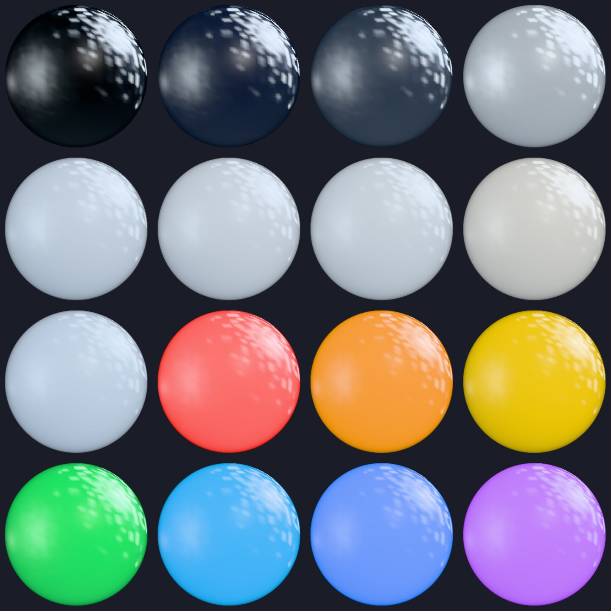

```rust
let backdrop = Color::CHARCOAL;          // sRGB #1a1d28, the DarkStudio backdrop hue
let warm_bulb = Color::from_kelvin(3200.0);   // colour-temperature helper
let accent = Color::from_hex("#0a84ff")?;    // designer-friendly hex
```

Use `Scene::frame_bounds()` instead of manually tuning camera distance. The
framing solver projects the AABB into the requested viewport and solves from
both axes, so portrait/mobile and wide objects stay centered and unclipped.
For first renders where the default standard lens and front view are enough,
`Scene::add_perspective_camera_default_for(bounds, (width, height))` inserts
and activates the camera in one call.

## Camera views

Pick a camera angle the way you would in Blender or any CAD tool: by name, or
by azimuth and elevation in degrees. No coordinate math.

```rust
FramingOptions::new().front();                 // camera at +Z
FramingOptions::new().back();                  // camera at -Z
FramingOptions::new().left();                  // camera at -X
FramingOptions::new().right();                 // camera at +X
FramingOptions::new().top();                   // camera at +Y (looking down)
FramingOptions::new().bottom();                // camera at -Y (looking up)
FramingOptions::new().isometric();             // classic 3D isometric
FramingOptions::new().three_quarter_front_right();
FramingOptions::new().three_quarter_front_left();
FramingOptions::new().three_quarter_back_right();
FramingOptions::new().three_quarter_back_left();
```

```rust
// Custom angle: 28 degrees to the left of front, 18 degrees above horizon.
FramingOptions::new().azimuth_elevation(-28.0, 18.0);
```

Azimuth and elevation are in degrees and use the conventions documented on
`FramingOptions::azimuth_elevation`.

The camera's *lens* (field of view) is a separate choice from where the
camera points. Pick a named lens preset rather than typing a raw FOV:

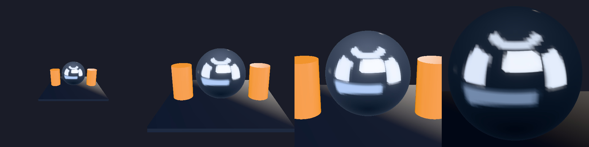

```rust
PerspectiveCamera::wide_angle();   // ~84° vertical — establishing shot
PerspectiveCamera::standard();     // ~46° vertical — default
PerspectiveCamera::portrait();     // ~28° vertical — tighter
PerspectiveCamera::telephoto();    // ~18° vertical — compressed perspective
```

When a project genuinely needs a non-preset field of view, the
`PerspectiveCamera` builder exposes a `with_fov_degrees` escape hatch —
see its rustdoc on docs.rs. Keep that escape-hatch call inside a
project-local helper so the first-path examples stay on named presets.

## Orbit controls

After framing, pass the returned `FramingOutcome` to controls so the first user
drag orbits around the framed object:

```rust
let framing = scene.frame_bounds(camera, bounds, FramingOptions::new().viewport(width, height))?;
let controls = scena::OrbitControls::from_framing(framing).cinematic();
```

Clamp wheel and pinch zoom relative to that framed distance when a viewer
should stay near the inspected object:

```rust
let controls = scena::OrbitControls::from_framing(framing)
    .cinematic()
    .zoom_limits_bounds_relative(0.5, 4.0);
```

Use `presentation()` or `turntable(rpm)` when the host should advance the
camera between input events:

```rust
let mut controls = scena::OrbitControls::from_framing(framing).presentation();
let delta_seconds = 1.0 / 60.0;
if matches!(controls.advance(delta_seconds), scena::OrbitControlAction::Orbit) {
    controls.apply_to_scene(&mut scene, camera)?;
}
```

Host adapters can then apply the controls to the scene camera each frame.

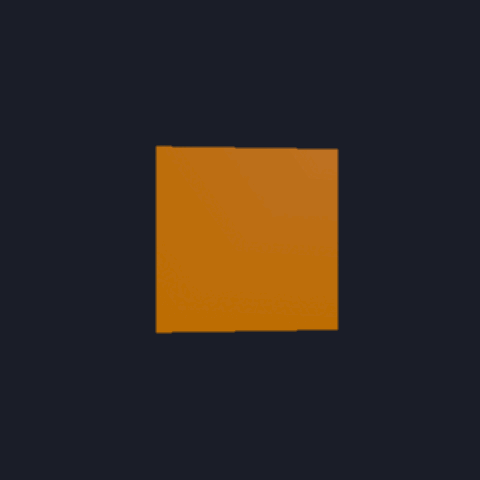

The cube above starts at full angular velocity and decays under
`cinematic()` damping; user-driven orbit input would feel the same way.

```rust
let controls = OrbitControls::from_framing(framing)
    .cinematic()
    .zoom_limits_bounds_relative(0.5, 4.0);
```

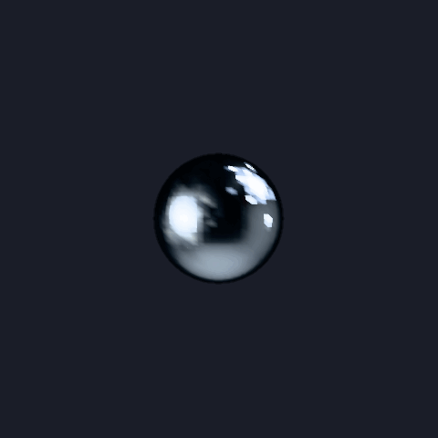

The zoom limits clamp wheel and pinch input relative to the framed
distance, so users cannot accidentally fly through the subject or lose
it off-screen.

Use `FollowControls` when a camera should track a moving node from a stable
offset:

```rust
let target_node = import.root;
scena::FollowControls::behind_and_above(3.0, 1.25)
    .apply_to_scene(&mut scene, camera, target_node)?;
```

Use `FlyControls` for CAD-style inspection or first-person navigation where
the host owns keyboard, pointer, or gamepad input and sends local movement
deltas explicitly:

```rust
let mut fly = scena::FlyControls::new(Vec3::ZERO)
    .with_yaw_pitch_degrees(90.0, 0.0);

fly.move_local(forward, right, up, delta_seconds);
fly.look_delta(pointer_delta_x, pointer_delta_y);
fly.apply_to_scene(&mut scene, camera)?;
```

## Viewer pointer callbacks

Interactive viewers can route host pointer coordinates through the same typed
picking path used by direct scene queries. The callback receives hit, miss, and
error results without bypassing selection or hover state updates.

```rust
use std::cell::RefCell;
use std::rc::Rc;

let selected = Rc::new(RefCell::new(None));
let hovered = Rc::new(RefCell::new(None));

viewer.on_click({
    let selected = Rc::clone(&selected);
    move |result| *selected.borrow_mut() = result.ok().flatten().map(|hit| hit.target)
});

viewer.on_hover({
    let hovered = Rc::clone(&hovered);
    move |result| *hovered.borrow_mut() = result.ok().flatten().map(|hit| hit.target)
});

viewer.hover_at(pointer_x, pointer_y)?;
viewer.click_at(pointer_x, pointer_y)?;
```

Set hover and selection outlines on the renderer when the interaction state
should be visible in screenshots or demos:

```rust
renderer.set_hover_style(InteractionStyle::outline(Color::from_hex("#ffd240")?, 2.0));
renderer.set_selection_style(InteractionStyle::outline(Color::from_hex("#40a0ff")?, 3.0));
```

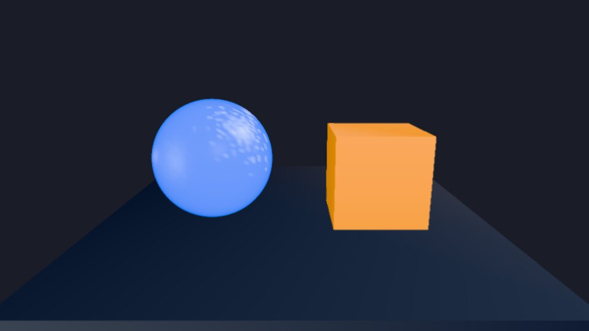

The CPU headless renderer used for the screenshot above runs the pick and
hover state through the same typed API; the outline overlay itself is
drawn by the GPU backends (`headless_gpu`, native window, browser
canvas) and shows up in the `<scena-viewer>` browser proof.

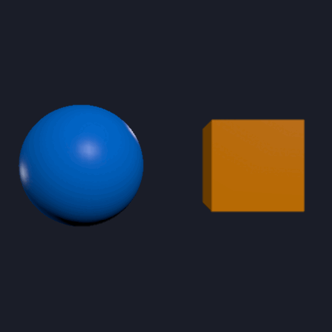

## Animation playback

Imported glTF clips can be started by name without manually creating and
starting a mixer:

```rust
let mixer = scene.play_animation_by_name(&import, "idle")?;
scene.update_animation(mixer, delta_seconds)?;
```

Viewer helpers can start a clip on their loaded import directly:

```rust
let mixer = viewer.play_clip("idle")?;
viewer.scene_mut().update_animation(mixer, delta_seconds)?;
```

Keep the returned mixer key when the host needs to pause, seek, change speed,
or switch loop mode.

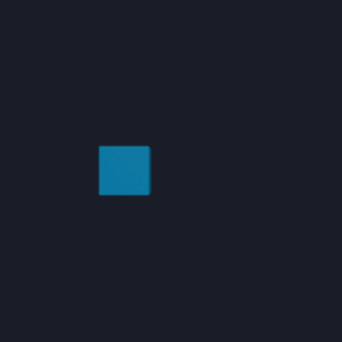

## Screenshot capture

After rendering, viewers can encode the current RGBA8 frame directly as PNG
bytes or write it to disk on native targets:

```rust
viewer.render_next_frame()?;
viewer.capture_png("frame.png")?;

let png = viewer.capture_png_bytes()?;
```

For build servers, docs, and asset pipelines that only need a PNG artifact, the
headless builder can load, frame, render, and encode in one call through the
CPU headless renderer, without requesting a GPU adapter:

```rust
let png = headless_gltf_viewer("machine.glb")
    .size(800, 600)
    .with_default_light()
    .render_png_bytes()
    .await?;
```

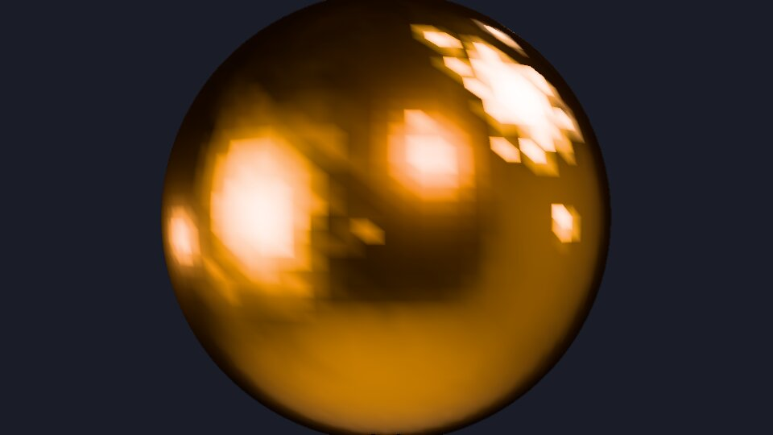

## Reference-image regression

Turn a rendered RGBA8 frame into a deterministic visual regression check by
comparing it with a stored reference image:

```rust
let actual = ReferenceImage::from_rgba8(width, height, viewer.snapshot_rgba8().to_vec())?;
let expected = ReferenceImage::from_rgba8(width, height, expected_rgba8)?;

let report = regress_with_tolerance(
    &actual,
    &expected,
    ReferenceImageTolerance::new().with_max_abs_diff(2),
)?;
assert!(report.passed());
```

## Asset load progress

Viewer builders can forward `AssetLoadProgress` events while loading and keep
the same events on the built viewer for status UIs and logs:

```rust
use scena::{AssetLoadProgress, headless_gltf_viewer};

let mut seen = Vec::new();
let viewer = headless_gltf_viewer("machine.glb")
    .build_with_progress(|event| seen.push(event))
    .await?;

for event in viewer.load_progress_events() {
    if let AssetLoadProgress::Parsed { nodes, meshes, .. } = event {
        println!("loaded {nodes} nodes and {meshes} meshes");
    }
}
```

## Material variants

Viewers surface `KHR_materials_variants` names from the loaded import and
re-prepare automatically when a variant is selected:

```rust
let mut viewer = headless_gltf_viewer("product.glb").build().await?;

for name in viewer.material_variants() {
    println!("variant: {name}");
}

viewer.set_active_material_variant(Some("blue"))?;
viewer.render_next_frame()?;

viewer.set_active_material_variant(None)?;
```

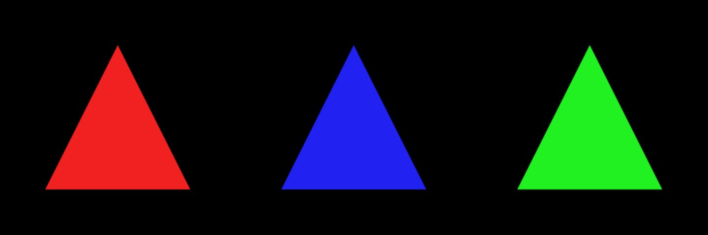

## Native asset hot reload

On native targets, enable the `hot-reload` feature and retain source bytes for
assets that should reload during development. The watcher emits debounced asset
paths; the host still reloads, replaces imports, prepares, and renders
explicitly.

```rust
use std::time::Duration;

assets.set_retain_policy(RetainPolicy::Always);
let scene_asset = assets.load_scene("machine.glb").await?;
let mut import = scene.instantiate(&scene_asset)?;
let mut watcher =
    assets.watch_scene_for_hot_reload(&scene_asset, Duration::from_millis(250))?;

for path in watcher.drain_changed_scenes()? {
    if path.as_str() == scene_asset.path().as_str() {
        let reloaded = assets.reload_scene(&scene_asset).await?;
        import = scene.replace_import(&import, &reloaded)?;
        renderer.prepare_with_assets(&mut scene, &assets)?;
    }
}
```

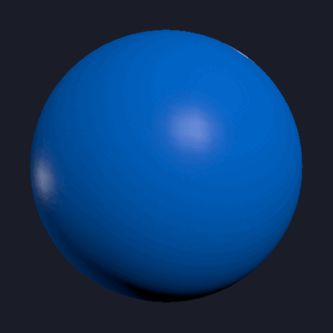

## Environment presets

Use `EnvironmentPreset` when examples, product viewers, or screenshots need a
named environment without hard-coding asset paths. The current preset catalog
uses the checked neutral fixture and a bundled Poly Haven studio HDR with
license, checksum, file-list, and package-size metadata.

```rust
let environment = assets
    .load_environment_preset(EnvironmentPreset::Studio)
    .await?;
renderer.set_environment(environment);
```

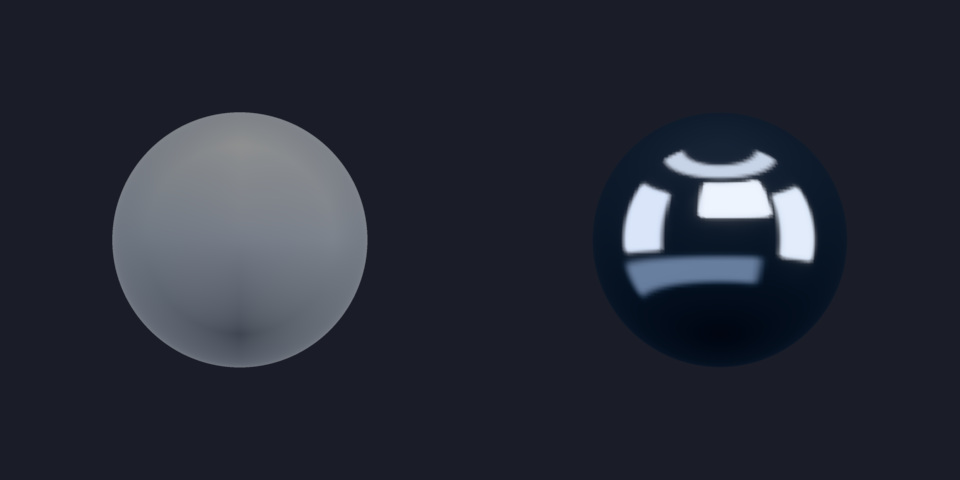

The metal sphere on the right reflects the studio HDR; on the left the
neutral fixture gives no directional reflection. That contrast is the
quickest way to verify the environment is actually bound to the
renderer.

Use `EnvironmentPreset::ALL` when compatibility proof should render every
checked preset. KTX2 cubemap presets are still future work; the shipped catalog
is intentionally limited to the environment formats the renderer can load
today.

## Khronos sample assets

Enable the `khronos-samples` feature when examples, tests, or demos need
canonical glTF sample assets without hard-coding local fixture paths. The
catalog carries source commit, license reference, checksum, file list, and
contract metadata so sample use stays auditable.

```rust
let bottle = assets.khronos().water_bottle().await?;
let rig = assets.khronos().rigged_simple().await?;
let transmission = assets.khronos().transmission_test().await?;
```

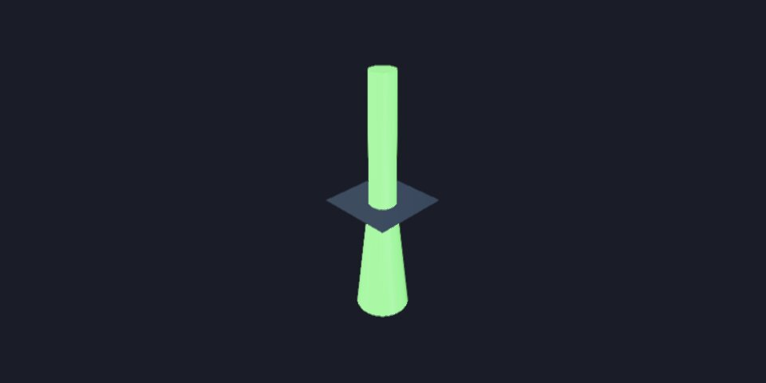

Use `KhronosSample::ALL` when a compatibility test should iterate the checked
catalog.

## URL camera state

Orbit camera state can be serialized into a shareable query string without
including asset URLs, tokens, or other application parameters. The value uses
model-viewer-style `camera-orbit` / `camera-target` keys with concrete units.

```rust
let query = controls.url_state().to_query_string();
let state = CameraOrbitUrlState::from_url_query(&query)?;
controls = controls.with_url_state(state)?;

let framed_query = framing.url_state().to_query_string();
```

The parser also accepts compact `?camera-orbit=-28,18,2.5` links and emits the
canonical unit form when reserialized.

## Connector mating

Authored connectors let two imported assets find each other without application
code typing coordinates or raw matrices:

```rust
let drive_part = assets.load_scene("drive_unit.glb").await?;
let load_part = assets.load_scene("load_unit.glb").await?;

let drive = scene.instantiate(&drive_part)?;
let load = scene.instantiate(&load_part)?;
scene.mate(&drive, "shaft", &load, "hub")?;
```

The connector names come from glTF extras. The demo assets intentionally cover
different authoring conventions: `drive_unit` is Y-up in millimeters and
`load_unit` is Z-up in meters. The asset loader normalizes that metadata so
`scene.mate(&drive, "shaft", &load, "hub")?` is the operation the app writes.

For replay or animation, compute framing bounds across all relevant poses:

```rust
let replay_bounds = scene.bounds_for_transforms(drive_root, &[before, after], &assets)?;
let label = scene.project_world_point(camera, connector_world_point, width, height)?;
```

If an interpolation path arcs outside its endpoints, include sampled
intermediate transforms in `bounds_for_transforms()`.

For editor-style drag-to-assemble UIs, preview the snap before committing
the mate so the host can render a ghost or a connection line:

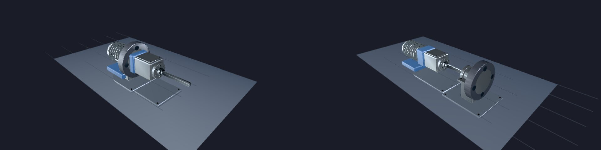

```rust
let preview = scene.preview_connector_magnet(
    drive_connector,
    load_connector,
    ConnectOptions::default(),
)?;
if preview.is_snap_ready() {
    // host draws the SnapReady cue (e.g. green outline)
} else {
    // host draws the OutOfRange cue (e.g. yellow / amber outline)
}
let ghost = preview.ghost_transform();
let line = preview.connection_line();
```

`preview.visual_cue().css_class()` returns `scena-magnet-ready` or
`scena-magnet-out-of-range` for host CSS styling; `accent_rgba()` returns
linear RGBA when the host wants to render the cue itself.

## Renderer features

`scena` ships output-space anti-aliasing, screen-space ambient occlusion,
subtle bloom, and weighted-blended order-independent transparency. Each is
opt-in through a typed config on the renderer.

```rust
use scena::{
    AntiAliasing, OrderIndependentTransparencyConfig, PostBloomConfig,
    ScreenSpaceAmbientOcclusionConfig,
};

renderer.set_anti_aliasing(AntiAliasing::Fxaa); // default; AntiAliasing::None for crisp diff lanes
renderer.set_bloom(Some(PostBloomConfig::subtle()));
renderer.set_screen_space_ambient_occlusion(Some(ScreenSpaceAmbientOcclusionConfig::subtle()));
renderer.set_order_independent_transparency(Some(OrderIndependentTransparencyConfig::weighted_blended()));
```

The ON/OFF pairs below are rendered side-by-side so the contribution of
each effect stays visible:

| Feature | Off ‖ On |
|---|---|
| FXAA anti-aliasing | 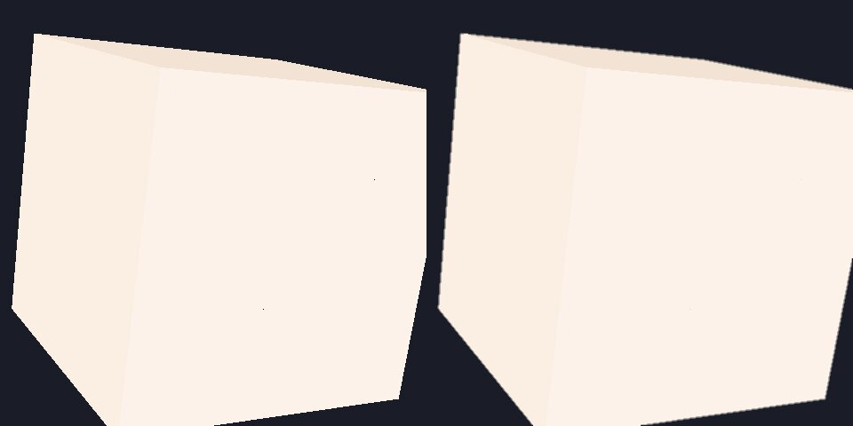 |
| Subtle bloom | 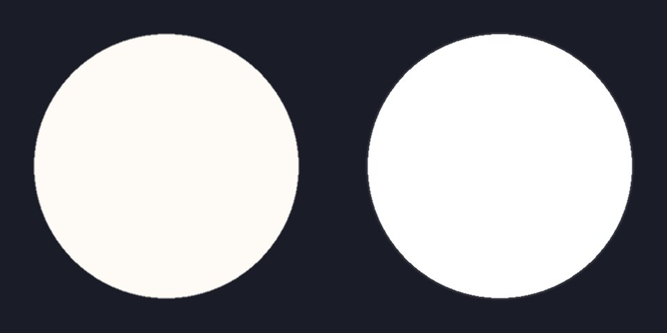 |
| SSAO (contact darkening) | 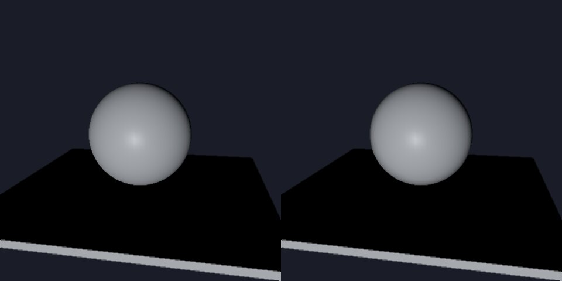 |
| OIT (insertion-order independence) | 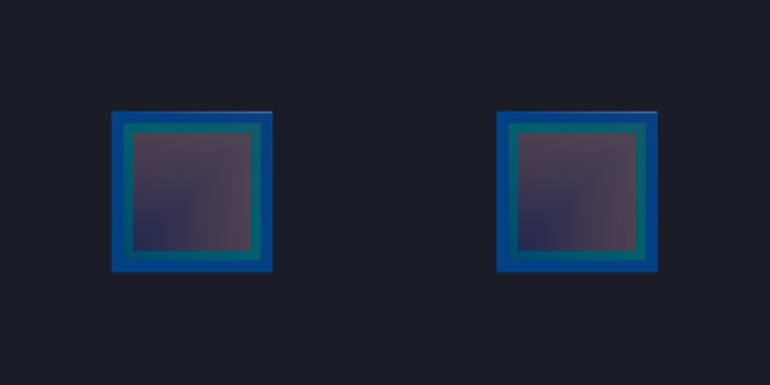 |

For OIT, the panels show the same three overlapping translucent planes
inserted in opposite order — they should look identical, proving the
draw order does not affect the result.

### glTF material extensions

`MaterialDesc` exposes builders for clearcoat, sheen, anisotropy,
iridescence, dispersion, transmission, IOR, and volume / attenuation,
plus the matching texture slots:

```rust
let lacquer = MaterialDesc::clearcoat_plastic(Color::CHARCOAL);

let fabric = MaterialDesc::satin(Color::DARK_GRAY);

let brushed = MaterialDesc::brushed_steel();

let film = MaterialDesc::plastic(Color::COOL_WHITE)
    .with_iridescence_factor(1.0)
    .with_iridescence_ior(1.34)
    .with_iridescence_thickness_range_nm(220.0, 720.0);

let glass = MaterialDesc::frosted_glass(Color::COOL_WHITE);
```

Visible before/after rendering for these lobes requires the WebGPU or
WebGL2 backend; the CPU/reference path samples the factors and textures
for regression tests but does not produce a differentially visible PBR
contribution. The release-grade visible proof comes from the M6 browser
proof — see
`target/gate-artifacts/m6-rust-wasm-renderer-probe.json` (look for
the `pbr-material-extensions` workflow and
`browser-pbr-material-extension-composite` proof class), which is
recorded against real-GPU CI runners.

The same browser proof includes a dense source-material lane under
`source-gltf-materials`: it loads the Khronos WaterBottle with strict texture
loading, records base-color, normal, metallic-roughness, occlusion, and
emissive source texture roles, frames the imported geometry with
`Scene::frame`, lights it with a real `DirectionalLight`, and renders
generated-unlit, source-glTF-material, and generated-PBR comparison lanes.

## Browser viewer surfaces

The browser side ships through `<scena-viewer>`, a custom element with
`<model-viewer>`-style attributes (drag-and-drop, material variants,
inspector overlay, mobile gestures). The Playwright lane in
`tests/browser/m6_rust_wasm_renderer_probe.js` regenerates the proof
artifacts on every release run, and the host-wirable event surface is
documented under [`docs/browser.md`](../browser.md).

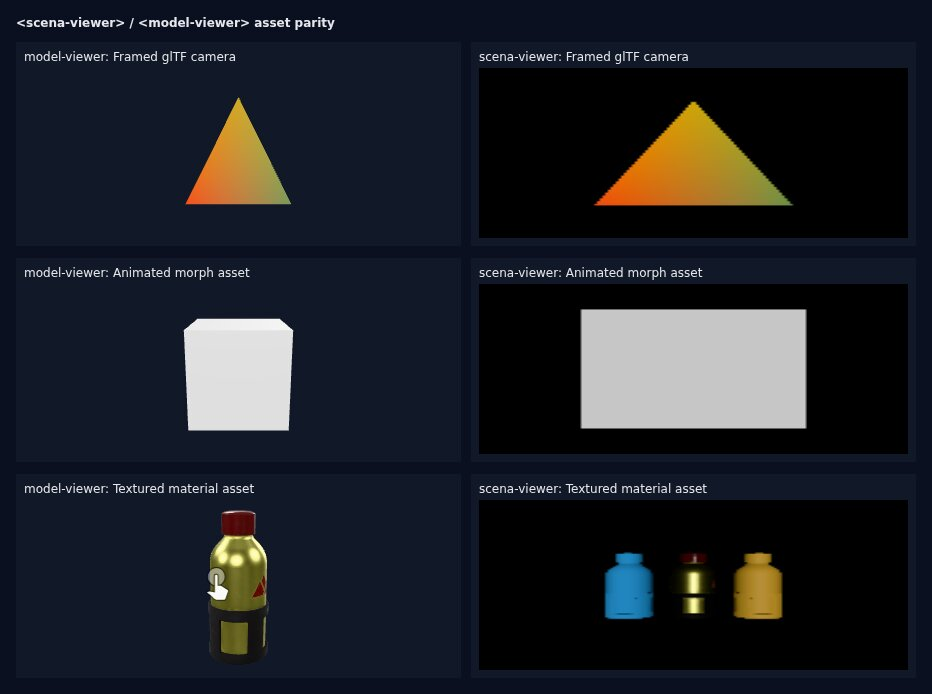

The side-by-side above is honest evidence: scena's WebGL2 rendering of
the WaterBottle and the animated morph cube is visibly behind
`<model-viewer>`'s in this CI snapshot. Closing that gap is a
known follow-up; the API surface for the custom element is shipped and
the host-wirable event contract is stable. The remaining work is shader
parity on the WebGPU / WebGL2 backends, tracked under the
`<scena-viewer>` bet in the next-release roadmap.

For the full set of browser-side proof artifacts (drag/drop event
sequence, mobile gestures, keyboard a11y, camera control kit, loading
progress, material-variant picker, annotation tracking, inspector
overlay), see
`target/gate-artifacts/m6-rust-wasm-renderer-probe.json` and the
companion screenshots written next to it on the release CI runner —
those records are the source of truth for "did the browser actually
behave this way," and they belong to the CI lane rather than the docs
tree.

## Troubleshooting

If the object is tiny, lower the floor padding first and check that you passed
only the model/replay bounds that should drive composition. Do not compensate
with a hard-coded camera distance.

If the object clips while still looking zoomed out, use `frame_bounds()` and
inspect `FramingOutcome::projected_rect`. Clipping from one side usually means
the camera target was not derived from projected bounds.

If the floor or grid appears behind the model like a wall, confirm the floor is
created with `GridFloorOptions::floor_y(0.0)` or the intended ground plane and
that all grid vertices stay on that plane.

If labels detach from geometry, derive them from connector or anchor world
positions and call `project_world_point()` after camera and object transforms
change. Static CSS percentages are not a valid 3D label contract.

If a render is bright and flat, separate the causes: auto exposure controls
global brightness, studio lighting controls scene shape, and materials control
albedo/metalness/roughness. Pure white albedo or flat roughness maps can still
look wrong under correct lighting.
